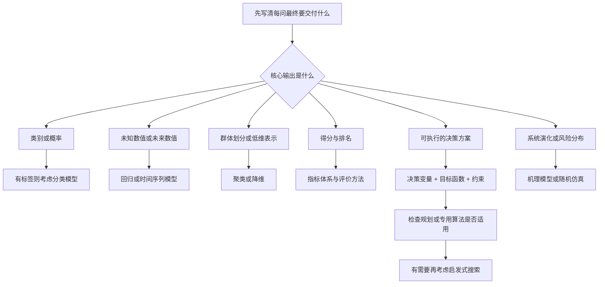

# 数学建模经典算法与选型指南

> 面向数学建模入门与竞赛备战，覆盖数据分析、预测、评价、优化、图论、机理建模和仿真。重点回答：这些方法分别解决什么问题、有什么区别、什么时候使用、需要掌握到什么程度。
>
> 本文把常用模型、算法与分析方法放在同一份指南中查阅，但会明确它们所属的层次。“完整”指覆盖常见任务和主要方法体系，不是穷尽所有算法。学习优先级与选型建议是实践建议，具体选择要通过题意、数据、约束和验证结果决定。

配套阅读：[C 题解题流程与建模方法](./01_C题解题流程与建模方法.md) · [建模手备战指南](./02_C题建模手备战指南.md) · [编程手备战指南](./03_C题编程手备战指南.md)

**推荐阅读路线：** 初学先读第 1—3 节，建立整体地图；重点关心随机森林、模拟退火和遗传算法时，读第 5、11 节；做题时查第 2、16、19 节；安排学习时读第 18 节。

## 目录

1. [先回答：是不是主要只有分类和聚类](#s01)
2. [数学建模的任务地图与经典方法总览](#s02)
3. [拿到题目后，怎样选择方法](#s03)
4. [统计分析、回归拟合与数值基础](#s04)
5. [监督学习：分类与回归预测](#s05)
6. [聚类：没有标准标签时发现分组](#s06)
7. [降维与特征选择：减少变量，保留信息](#s07)
8. [时间序列预测：明确时间与信息边界](#s08)
9. [综合评价与排序：把多指标变成决策依据](#s09)
10. [数学规划与动态规划：先把优化问题建对](#s10)
11. [启发式优化：模拟退火、遗传、粒子群等](#s11)
12. [图论与网络算法：关系、路径、分配和流量](#s12)
13. [机理模型、数值求解与随机仿真](#s13)
14. [异常检测、关联规则与其他按需方法](#s14)
15. [最容易混淆的概念与错误用法](#s15)
16. [典型建模场景：怎样组合不同方法](#s16)
17. [算法结果如何验证、比较和写进论文](#s17)
18. [经典方法掌握清单与学习顺序](#s18)
19. [Python 与 MATLAB 常用实现入口](#s19)
20. [参考资料与进一步阅读](#s20)

---

<a id="s01"></a>

## 1. 先回答：是不是主要只有分类和聚类

**不是。分类和聚类只是数学建模中的两类任务。随机森林主要用于分类和回归；模拟退火、遗传算法主要用于优化求解。**

这三个名字经常出现在同一篇建模论文中，是因为一个现实问题往往需要先预测，再决策，而不是因为它们都是分类算法。[S01]、[S02]、[S15]、[S20]

### 1.1 用六个小问题区分用途

| 现实问题 | 数学任务 | 输出是什么 | 可以考虑的方法 |
| --- | --- | --- | --- |
| 这家企业是否会违约 | 分类 | 违约类别或概率 | 逻辑回归、随机森林、SVM |
| 下周某商品能卖多少 | 回归或时间序列预测 | 销量数值、预测区间 | 回归、随机森林、指数平滑、ARIMA |
| 这些客户自然分成几种消费群体 | 聚类 | 分组及群体特征 | K-means、层次聚类、DBSCAN |
| 这些供应商综合表现谁更好 | 多指标评价 | 得分、排名及权衡依据 | AHP、熵权、TOPSIS |
| 在预算和库存限制下订多少货 | 优化决策 | 一组可执行的订货量 | LP、MILP、非线性规划；必要时使用启发式 |
| 改变服务窗口数量后，要排多久队 | 排队分析与仿真 | 等待时间、拥堵概率等 | 排队模型、离散事件仿真 |

这里有两个很有用的判断：

- **预测：** 在给定条件下，未来或未知结果可能是什么？
- **优化：** 在允许的选择中，采取什么行动更好？

预测明天会卖 100 千克，不等于应该订购 100 千克；订多少还取决于损耗、缺货成本、预算、库存和风险。

### 1.2 随机森林、模拟退火、遗传算法直接对照

| 比较项 | 随机森林 RF | 模拟退火 SA | 遗传算法 GA |
| --- | --- | --- | --- |
| 主要角色 | 从样本中学习预测规律 | 搜索目标函数较好的解 | 搜索目标函数较好的解 |
| 典型输入 | 特征、已知标签或数值目标 | 目标函数、可行域、初始解、邻域规则 | 目标函数、编码规则、可行域、初始种群 |
| 典型输出 | 训练好的预测模型、新样本预测 | 一个经过搜索的候选方案 | 一个或一组经过搜索的候选方案 |
| 是否通常需要带标签样本 | 标准分类、回归用法需要 | 不需要监督标签；目标可能依赖数据 | 不需要监督标签；目标可能依赖数据 |
| 核心思想 | 多棵随机化决策树集成 | 允许概率性接受变差的移动，并逐步降温 | 种群通过选择、交叉和变异演化 |
| 主要检验 | 对未见样本的预测效果 | 可行性、目标值、稳定性、计算成本 | 可行性、目标值、稳定性、计算成本 |
| 主要风险 | 过拟合、泄漏、外推失败 | 邻域或降温设计差、搜索不充分 | 编码或约束处理差、早熟收敛 |
| 是否自然附带全局最优证明 | 预测任务通常不讨论这种证明 | 有限运行一般没有 | 有限运行一般没有 |

“遗传算法预测销量”通常省略了中间层：真正负责预测的是某个回归、神经网络或机理模型，遗传算法负责搜索它的参数、特征子集或结构。

同理，随机森林可以作为优化模型中的需求预测器或仿真代理，但**单独训练一个随机森林，不会自动得到满足预算和库存约束的经营方案**。

### 1.3 任务、模型、算法、软件是不同层次

| 层次 | 回答的问题 | 示例 |
| --- | --- | --- |
| 任务 | 到底要解决什么 | 预测需求；降低成本；判断风险 |
| 模型 | 用什么数学关系表达 | 线性回归；库存平衡；混合整数线性规划 |
| 算法 | 怎样从模型计算答案 | 最小二乘求解；分支定界；模拟退火 |
| 软件 | 用什么工具实现 | Python、MATLAB、scikit-learn、HiGHS |

一些名称在日常表达中兼指模型与训练方法，例如“随机森林算法”“K-means 算法”，并非不能这样说。关键是写论文时不要遗漏问题定义。

三个例子：

```text
任务：预测销量
模型：销量与天气、节假日、历史销量之间的回归关系
方法：随机森林回归
实现：RandomForestRegressor

任务：确定生产计划
模型：利润最大化 + 资源约束 + 整数产量变量
求解：MILP 求解器中的分支定界、割平面等
实现：SciPy milp / Pyomo + 求解器

任务：安排复杂加工顺序
模型：在先后关系、机器容量约束下最小化完工时间
求解：CP-SAT，或设计合适邻域后使用模拟退火
实现：OR-Tools，或自行实现搜索过程
```

**学习时按任务建立知识树；求解时先看模型结构；写作时说明算法为什么适合这个结构。**

---

<a id="s02"></a>

## 2. 数学建模的任务地图与经典方法总览

这些类别会交叉，并非严格互斥。例如，时间序列预测可以使用回归，评价方法可以包含优化模型，机器学习模型的训练本身也经常是优化问题。

| 任务类别 | 常见题目动词 | 经典方法或模型 | 主要交付物 |
| --- | --- | --- | --- |
| 描述与统计推断 | 分析规律、比较差异、检验关系 | 描述统计、相关分析、t 检验、卡方检验、ANOVA、回归 | 统计量、效应估计、区间、检验结果 |
| 回归与数值预测 | 预测数值、估计参数、拟合关系 | 线性回归、Ridge、Lasso、SVR、随机森林、GBDT | 预测函数、预测值及误差 |
| 分类 | 鉴别类型、判别风险、识别状态 | 逻辑回归、决策树、随机森林、SVM、kNN、朴素贝叶斯 | 类别、概率、判别规则 |
| 聚类 | 划分群体、寻找亚类 | K-means、层次聚类、DBSCAN、GMM | 簇划分、簇中心、群体画像 |
| 降维与特征选择 | 提取主要信息、减少变量 | PCA、SVD、因子分析、Lasso、RFE、t-SNE | 低维表示或特征子集 |
| 时间序列 | 预测未来趋势、分析周期 | 朴素预测、指数平滑、ARIMA、SARIMA、动态回归 | 未来各期预测及区间 |
| 评价与排序 | 综合评价、择优、确定权重 | 加权评分、AHP、熵权、TOPSIS、模糊综合评价、DEA | 得分、排序、效率或偏好比较 |
| 数学规划 | 最大化收益、最小化成本、配置资源 | LP、IP/MILP、QP、NLP、CP、动态规划 | 满足约束的决策方案 |
| 通用优化搜索 | 在复杂方案空间寻找较优解 | 贪心、局部搜索、SA、GA、PSO、ACO、DE、禁忌搜索 | 可行方案、目标值、搜索证据 |
| 图与网络 | 最短路线、连接、匹配、输送 | BFS、Dijkstra、Floyd、Prim、Kruskal、最大流、最小费用流 | 路径、树、匹配或流量分配 |
| 机理与数值计算 | 解释演化、模拟运动、拟合动力学 | 微分方程、差分方程、Markov 链、Euler、Runge–Kutta、有限差分 | 系统轨迹、状态与参数 |
| 随机模拟与风险 | 估计概率、分析波动、评估策略 | Monte Carlo、Bootstrap、排队模型、离散事件仿真 | 分布、区间、风险与运行指标 |
| 异常与关联 | 识别异常、发现共现模式 | Isolation Forest、LOF、Apriori、FP-growth | 异常分数、关联规则 |

从机器学习角度，可以再区分：

- **监督学习：** 用已知输出训练，包括分类与回归。
- **无监督学习：** 在没有目标标签时发现结构，包括聚类、部分降维和异常检测。
- **半监督学习：** 少量有标签样本结合大量无标签样本。
- **强化学习：** 根据连续交互与奖励学习策略。

这个分类描述的是**学习范式**，不能用来替代上面的数学建模任务地图。模拟退火、遗传算法也不应简单归入“无监督学习”。

---

<a id="s03"></a>

## 3. 拿到题目后，怎样选择方法

### 3.1 先确定最终输出

下面的流程用于选方向，多个分支可以共同组成一套解答。



若 Markdown 阅读器不支持 Mermaid，可以直接使用第 2 节的任务表。

### 3.2 选择算法前，回答八个问题

1. **输出是什么？** 数值、标签、排名、路径，还是一整套决策？
2. **一行数据代表什么？** 一个人、一次检测、一个商品日，还是一笔交易？
3. **有没有可靠标签？** 标签是否是当时真实可得的结果？
4. **是否存在时间或对象依赖？** 同一对象重复测量不能随意拆到训练与测试两边。
5. **目标与约束是什么？** “效果好”必须具体到成本、利润、风险或公平等量。
6. **是否有可利用的结构？** 线性、凸性、网络、分阶段、守恒关系等。
7. **计算预算与解释要求是什么？** 能算多久，需要多少次仿真，能否解释给实际使用者？
8. **怎样知道做对了？** 留出验证、滚动回测、约束审计、最优性界、扰动分析等。

### 3.3 一条实用的升级顺序

```text
明确问题和数据口径
    → 做出简单基线
    → 用正确方式验证
    → 找到具体缺陷
    → 增加能解决该缺陷的复杂度
    → 比较收益、稳定性、时间与解释成本
```

例如：

- 线性模型遗漏明显的非线性和交互，可比较随机森林或梯度提升。
- K-means 把弯曲群体切碎，可比较 DBSCAN 或谱聚类。
- 优化模型存在大量排班逻辑，可考虑约束规划。
- 目标只能通过复杂仿真评价，可考虑无导数搜索或代理模型优化。

**没有脱离问题的“最强算法”。** 一个满足约束、验证充分、能解释的简单方案，通常比无法检验的复杂组合更有价值。

---

<a id="s04"></a>

## 4. 统计分析、回归拟合与数值基础

### 4.1 统计分析不是可有可无的前置步骤

| 方法 | 核心用途 | 什么时候用 | 主要边界 |
| --- | --- | --- | --- |
| 均值、中位数、分位数、方差 | 描述水平与波动 | 几乎所有数据题 | 均值易受极端值影响；汇总会掩盖分组差异 |
| Pearson 相关 | 描述线性关联 | 连续变量之间的关系探索 | 零相关不等于无关系；相关不等于因果 |
| Spearman / Kendall | 描述秩关系、单调关联 | 等级数据、单调但非线性的关系 | 仍不能解决混杂；并非任意关系都能识别 |
| t 检验 / Welch 检验 | 比较均值 | 独立两组均值比较；配对设计用配对检验 | 区分独立与配对、分布形态与样本规模；不等方差可考虑 Welch |
| 卡方独立性检验 / Fisher 精确检验 | 分析分类变量关联 | 类别比例、列联表 | 小期望频数时不能机械套卡方近似 |
| 方差分析 ANOVA | 比较多组均值 | 多处理、多群体比较 | 拒绝整体原假设后，还需合适的组间比较；注意假设与多重检验 |
| Mann–Whitney / Kruskal–Wallis 等 | 基于秩比较分布 | 正态等假设不合适时的候选 | 不是在所有情况下都等价于“中位数检验” |
| 置信区间与效应量 | 表达估计大小及精度 | 报告组间差异、模型参数 | p 值小不等于影响大；置信区间不同于个体预测区间 |

一条基本原则：**检验方法要服从采样与实验设计。** 同一孕妇多次采血、同一设备反复观测、同一文物多个采样点，通常存在组内相关性，不能只因表格有很多行就当作很多独立样本。

当题目要求“影响因素分析”，先区分：描述关联、预测重要性，还是干预后的因果效应。随机森林的重要性和回归系数都不会自动解决因果识别问题。

### 4.2 线性回归、Ridge、Lasso 是应优先掌握的基础

线性回归把条件均值近似为：

$$
y_i=\beta_0+\sum_{j=1}^{p}\beta_jx_{ij}+\varepsilon_i.
$$

普通最小二乘最小化残差平方和：

$$
\min_{\beta_0,\beta}\sum_{i=1}^{n}(y_i-\beta_0-x_i^\top\beta)^2.
$$

**“线性”指对系数线性。** 加入 $x^2$、交互项或预先构造的样条基函数后，仍可能是线性回归模型。[S03]

| 方法 | 相对普通线性回归增加什么 | 适用情况 | 注意什么 |
| --- | --- | --- | --- |
| 普通最小二乘 OLS | 基础模型 | 关系较简单、重视解释、需要基线 | 共线性会使系数不稳定；推断需要相应误差假设 |
| Ridge 岭回归 | $L_2$ 惩罚，收缩系数 | 特征相关、变量较多，主要追求稳定预测 | 通常不把系数变成精确的零；应考虑标准化 |
| Lasso | $L_1$ 惩罚，产生稀疏系数 | 希望从较多特征中选择子集 | 强相关变量中选择可能不稳定，不等于找到真正原因 |
| Elastic Net | 混合 $L_1$ 与 $L_2$ | 既需稀疏性，又有成组相关特征 | 正则化强度与混合比例都需验证 |
| 多项式 / 样条回归 | 扩充函数形状 | 低维、平滑非线性 | 高次多项式外推易失控；复杂度仍需控制 |
| 稳健回归，如 Huber | 降低大残差的支配作用 | 有少量异常响应、重尾噪声 | 不能自动修正所有异常点、错误单位和高杠杆点 |

常见正则化形式为：

$$
\text{Ridge}:\quad \min_{\beta_0,\beta}\frac{1}{n}\sum_i(y_i-\beta_0-x_i^\top\beta)^2+\lambda\sum_j\beta_j^2,
$$

$$
\text{Lasso}:\quad \min_{\beta_0,\beta}\frac{1}{n}\sum_i(y_i-\beta_0-x_i^\top\beta)^2+\lambda\sum_j|\beta_j|.
$$

这里约定不惩罚截距，软件中的常数系数约定可能不同。$\lambda$ 越大，收缩通常越强，需要通过验证来选，而不是只看训练误差。

### 4.3 拟合、插值、预测的区别

| 名称 | 目标 | 典型方法 | 典型误区 |
| --- | --- | --- | --- |
| 拟合 | 描述整体关系，允许残差 | 最小二乘、非线性回归、平滑样条 | 拟合优度高就认为预测可靠 |
| 插值 | 在已知节点之间构造函数值，经典插值通过节点 | 分段线性、三次样条、PCHIP | 对带噪观测逐点穿过可能放大噪声；长缺口插值会虚构细节 |
| 外推 / 预测 | 推断未观测条件或未来结果 | 回归、时序、机理模型 | 默认训练区间内的规律永远延续 |

插值方案要尊重时间、物理边界与单调性。例如，普通三次样条可能超调；形状保持插值 PCHIP 可在适合的场景减少这类问题。[S28]

### 4.4 数值算法也属于建模基本功

| 算法 | 用途 | 什么时候用 | 关键条件 |
| --- | --- | --- | --- |
| 二分法 | 求一元方程根 | 连续函数且有异号区间 | 收敛稳健；要先确认区间内的根与业务含义 |
| Newton 法 | 利用导数快速找根 | 导数可算、初值合理 | 可能跳出范围、遇到导数近零或不收敛 |
| Brent 类方法 | 结合括区间的稳健性与插值加速 | 一元求根 | 求根与一元最小化都有同名家族，注意接口 |
| QR / SVD 最小二乘 | 稳定求线性拟合参数 | 线性模型、病态矩阵检查 | 通常优于手工求 $(X^\top X)^{-1}$ |
| 梯度下降、Newton、拟 Newton | 最小化可微目标 | 参数估计、模型训练、连续优化 | 步长、曲率、尺度与凸性影响结果 |

正态误差并不是计算最小二乘解的必要条件；但具体的置信区间、显著性检验与最优性结论，需要各自的假设。不要把“能算出系数”和“可以做可信推断”混为一谈。

---

<a id="s05"></a>

## 5. 监督学习：分类与回归预测

监督学习训练数据包含输入 $X$ 和目标 $y$。若 $y$ 是类别，主要是分类；若 $y$ 是数值，主要是回归。有序等级、计数、删失时间等还有更专门的模型，不能仅凭“这一列存的是数字”就决定用普通回归。[S01]

### 5.1 经典模型比较表

| 模型 / 方法 | 常见任务 | 核心思想 | 适合什么情况 | 主要代价或局限 |
| --- | --- | --- | --- | --- |
| 线性回归及正则化 | 回归 | 用线性组合预测数值 | 简单关系、可解释基线、有限样本 | 复杂非线性要主动构造特征 |
| 逻辑回归 | 分类 | 线性评分经链接函数转成概率 | 二分类基线、风险概率、解释关联 | 默认线性评分难表达复杂边界 |
| k 近邻 kNN | 分类、回归 | 参考最相似的若干样本 | 距离有实际含义、维度较低 | 依赖尺度与距离；高维效果易下降，预测成本可能高 |
| 朴素贝叶斯 | 分类 | 条件独立假设下结合证据 | 文本、稀疏特征、快速基线 | 条件独立常不成立；概率校准可能较差 |
| 决策树 CART | 分类、回归 | 通过一系列条件切分样本 | 需要清楚的分段规则 | 单树方差较大，深树易过拟合 |
| 随机森林 RF | 分类、回归 | 多棵随机化树集成 | 表格数据、非线性、交互关系 | 模型较大，单条规则解释困难，外推弱 |
| SVM / SVR | 分类、回归 | 间隔思想；核函数表达非线性 | 中小规模、较高维数据的候选 | 通常要缩放特征；核、正则参数敏感，大样本可能昂贵 |
| AdaBoost | 主要常见于分类，也有回归变体 | 后续学习器重视此前难处理的样本 | 较简单弱学习器的集成 | 标签噪声和离群样本可能带来影响 |
| GBDT 及其实现 | 分类、回归 | 顺序添加模型降低损失 | 表格数据、有非线性与交互 | 需控制学习率、树复杂度与迭代次数 |
| 多层感知机 MLP | 分类、回归 | 多层可训练非线性变换 | 有足够有效数据、复杂函数关系 | 训练和调参成本较高，需要正则化与可靠验证 |

表中的“适合”是候选方向，不是性能排名。样本质量、特征、验证切分的影响，常常超过换一个模型名称的影响。

### 5.2 逻辑回归：名字含“回归”，主要解决分类

二分类逻辑回归写作：

$$
P(y=1\mid x)=\sigma(\beta_0+\beta^\top x),
\qquad
\sigma(z)=\frac{1}{1+e^{-z}}.
$$

它输出概率估计，再根据业务选择阈值，转换成类别。阈值不一定必须是 0.5：漏判代价、误报代价、资源容量和概率校准都会影响选择。[S03]

**何时优先用：** 违约、异常、合格与否等二分类；需要解释变量与风险的关联；希望先得到易诊断的基线。

**需掌握：** 对数几率、系数解释、正则化、分类阈值、类别不平衡。概率看起来像 0—1 的数，并不自动意味着校准良好。

### 5.3 决策树：用条件把样本逐步分开

例如：

```text
历史违约记录是否存在？
├─ 是 → 进入一个风险较高的叶节点
└─ 否 → 再根据现金流、负债率等继续划分
```

分类树在叶节点估计类别或类别概率；回归树在叶节点给出数值预测。CART 常通过贪心方式寻找当前较好的切分，因此一棵树的训练不是穷尽全部树结构寻找全局最优。

**何时用：** 需要清晰的分段规则、变量交互明显、想建立一个可解释基线。

**关键参数：** 最大深度、叶节点最少样本数、剪枝强度等。树分得越细，训练集通常越好看，但对新样本未必越好。

### 5.4 随机森林：为什么多棵树比一棵树常常更稳

经典随机森林结合两种随机化，再把树的预测集成：[S02]

1. 从训练数据中进行 Bootstrap 抽样，训练不同树。
2. 节点分裂时只考虑随机选取的候选特征，以减少树之间的相关性。
3. 汇总多棵树的结果。

实际实现的抽样开关、候选特征数量等可以配置；不能假定每个库的默认值完全相同。

回归的典型聚合是平均：

$$
\widehat y(x)=\frac{1}{B}\sum_{b=1}^{B}T_b(x).
$$

分类可以聚合投票或类别概率。以 scikit-learn 的随机森林分类器为例，使用树的类别概率平均，再选择概率最大的类别；不要把所有实现都写成硬投票。

**核心直觉：** 单棵深树可能对数据扰动很敏感；多棵相关性较低的树平均后，预测方差通常降低。但如果每棵树都学到了同一个数据泄漏，平均无法纠正这个错误。

**适用场景：** 企业风险、材料类别、商品需求、设备状态等表格数据中的非线性分类或回归。

**通常的优点：**

- 可以表达非线性和特征交互。
- 对特征尺度通常没有距离模型那么敏感，一般不必仅为树模型做标准化。
- 相比单棵树常更稳定，是值得掌握的强基线。

**需要特别记住的限制：**

- 仍会过拟合，尤其在有效样本少、标签噪声大或验证不当时。
- 常规回归树叶节点输出训练响应的均值；这样的随机森林预测不会超出相应训练响应的整体范围，不适合直接承担持续增长趋势的外推。
- 基于不纯度下降的特征重要性可能偏向可切分取值较多的变量；留出数据上的置换重要性可作补充，但相关特征也会影响解释。[S35]
- OOB（袋外）评估利用某些树训练时未抽到的样本；它不能替代预测未来的时间回测，也不能自动处理同一对象跨样本的依赖。
- 缺失值、类别特征的支持取决于具体库和版本；“树算法不怕数据问题”是错误理解。

**需掌握的参数：** 树的数量、候选特征数、最大深度、叶节点最少样本数、Bootstrap 设置和类别权重。增加树数通常有稳定平均的作用，但不能代替对树复杂度和验证方法的控制。

### 5.5 随机森林与 GBDT、XGBoost、LightGBM、CatBoost

| 比较项 | 随机森林 | 梯度提升树 GBDT 及常见实现 |
| --- | --- | --- |
| 树之间的关系 | 主要通过随机化独立训练后集成 | 后面的树基于当前整体模型继续改进 |
| 主要机制 | 平均降低方差 | 沿损失下降方向逐步增加模型 |
| 训练并行 | 各棵树通常易并行 | 提升轮次通常有依赖，轮内计算仍可并行 |
| 主要复杂度控制 | 树深、叶样本数、特征抽样等 | 学习率、迭代轮数、树深、正则化等 |
| 学习起点 | 较容易建立稳定基线 | 建议理解损失与验证后进一步掌握 |
| 是否保证更好 | 不保证 | 同样不保证，必须在相同验证方式下比较 |

GBDT 逐步拟合的是与损失函数相关的改进方向；“每一步拟合残差”对平方误差回归尤其直观，不能原样套到所有分类损失。

XGBoost、LightGBM、CatBoost 是梯度提升家族的常见算法与工程实现，分别在正则化、计算效率、类别特征处理等方面有不同设计。入门时先掌握一种，重点理解训练、验证和调参，不必同时背三套参数。[S02]

### 5.6 SVM、kNN、朴素贝叶斯分别什么时候考虑

**SVM：** 当样本规模适中、边界较复杂或特征较多时，可与逻辑回归、树模型比较。核函数可以表达非线性，代价是核与参数选择、计算成本。SVC 的原始决策分数不是已校准概率；SVR 则用于连续数值预测。[S04]

**kNN：** 当“相似对象有相似结果”合理、距离有意义时很好理解。训练主要保存样本，预测时找邻居并投票或平均；标准化、$k$ 和距离度量非常重要。不要与 K-means 混淆：kNN 参考已知标签做预测，K-means 在无标签样本中寻找中心。

**朴素贝叶斯：** 在给定类别的条件下，把特征近似视为独立，再用贝叶斯公式分类。常见于文本和稀疏计数特征；Gaussian、Multinomial、Bernoulli 版本对应不同特征分布假设，不能随意互换。[S01]

### 5.7 神经网络什么时候值得学、什么时候值得用

应先掌握一个简单 MLP，理解损失、反向传播、梯度优化、正则化和早停，再按题目学习 CNN、LSTM 等。

- **MLP：** 一般非线性映射，分类、回归均可。
- **CNN：** 图像、局部空间模式等。
- **RNN / LSTM / GRU：** 序列关系，是时序模型的候选之一。
- **Transformer：** 更复杂的序列或多模态任务，通常不是普通小样本表格建模的入门首选。

“BP 神经网络”一般指通过反向传播训练的网络；反向传播负责计算梯度，参数更新还需要梯度下降、Adam 等优化方法。深度增加不能弥补数据不足，也不自动带来更可信的解释。

---

<a id="s06"></a>

## 6. 聚类：没有标准标签时发现分组

聚类根据选定的特征与相似性，把对象划成群体。它回答的是“在这个表示与距离下，哪些对象相似”，并不自动给出“真实类别”。[S05]

### 6.1 四类最值得先掌握的方法

| 方法 | 核心机制 | 需预先指定簇数吗 | 适用情况 | 主要局限 |
| --- | --- | --- | --- | --- |
| K-means | 交替分配样本、更新中心，减小簇内平方距离 | 需要 $K$ | 数值特征、较紧凑且尺度相近的群体 | 对尺度、离群点、初始化敏感；不适合任意弯曲形状 |
| 凝聚型层次聚类 | 从小簇开始按连接规则逐步合并 | 可先建树，再选择切分层级 | 样本量不太大、希望观察分层结构 | 距离和 linkage 影响大；许多实现有较高的成对计算成本 |
| DBSCAN | 依据密度连接核心点，并标记噪声 | 不需要直接指定 | 非球状群体、带噪空间数据 | 半径与密度参数敏感；密度差异大、高维时较难 |
| GMM 高斯混合模型 | 用多个高斯成分表示分布，估计归属概率 | 通常需要成分数 | 允许重叠、椭圆形群体、需要软分组 | 高斯成分假设与协方差估计可能不适合数据 |

进阶候选包括谱聚类、HDBSCAN、模糊 C 均值（FCM）。谱聚类关注相似图结构；HDBSCAN 扩展密度层次思想；FCM 给出模糊隶属度。**FCM 隶属度不应自动解释为经过概率校准的真实类别概率。**

### 6.2 K-means 的核心目标与边界

$$
\min_{C_1,\ldots,C_K}\sum_{k=1}^{K}\sum_{x_i\in C_k}\|x_i-\mu_k\|_2^2.
$$

其中 $\mu_k$ 是第 $k$ 个簇的中心。常见 Lloyd 迭代反复做“分配到最近中心”和“更新中心”，通常收敛到局部结果，因此要注意初始化与多次重启。

K-means 并不要求数据严格服从高斯分布；只是它的距离目标更适合某些紧凑、尺度接近的结构。若一个特征是万元、另一个是 0—1 比例，未经处理的欧氏距离可能主要由前者决定。

**怎样选 $K$：** 结合业务分组需要、轮廓系数、肘部变化、不同初始化和扰动下的稳定性。肘部不一定存在，也不是严格的“真实簇数证明”。

### 6.3 层次聚类、DBSCAN、GMM 的关键区别

**层次聚类：** 可通过树状图观察不同尺度的分组。single、complete、average、Ward 等连接方式回答不同的“簇间接近程度”；Ward 通常按欧氏空间中的簇内方差增量合并，不能任意配一个非欧氏距离。

**DBSCAN：** 核心参数是邻域半径 `eps` 和最低邻域样本量 `min_samples`。它可以把低密度点标为噪声；“噪声点”只是相对于当前参数的结构判断，不等于错误数据，不能直接全部删除。

**GMM：** 常用 EM 算法估计混合权重、均值和协方差，输出样本属于各成分的概率。EM 是求解方法，GMM 是模型；EM 也可用于其他含隐变量模型。需防止局部解、协方差退化，并结合 BIC/AIC、验证或业务依据选成分数。[S06]

### 6.4 聚类结果怎么验证

- 检查簇大小、中心、分布和业务解释，有没有把单位差异当成结构。
- 比较不同初始化、样本扰动、尺度处理后的分组稳定性。
- 轮廓系数、Davies–Bouldin、Calinski–Harabasz 等只衡量特定结构，不能成为唯一依据。
- 有独立参考标签时，可用 ARI、NMI 等比较；簇编号本身没有固定语义，不能直接把“簇 0/1”与“类别 0/1”逐项算准确率。
- 二维可视化中的几个团块不构成真实类别的证明。

若题目已给可靠类别并要求识别新样本，通常先考虑监督分类；如果要求在已有大类内部找亚类，可以在各类内进一步聚类。

---

<a id="s07"></a>

## 7. 降维与特征选择：减少变量，保留信息

**聚类是在分对象，降维是在改变变量表示。** 二者经常组合，但输出和目标不同。

| 方法 | 主要输出 | 核心思想 | 什么时候用 | 需要注意 |
| --- | --- | --- | --- | --- |
| PCA 主成分分析 | 原变量的少量线性组合 | 在正交方向上尽量保留方差 | 数值指标相关、压缩、去冗余、可视化 | 方差大不等于对目标重要；需考虑尺度 |
| SVD 奇异值分解 | 矩阵分解及低秩近似 | 找主要矩阵结构 | 最小二乘、PCA、低秩压缩、稀疏文本 | 它是矩阵工具，不自动完成分类或评价 |
| 因子分析 | 潜在因子和载荷 | 用少数潜变量解释协方差 | 希望讨论不可直接观测的共同因素 | 需要模型假设、识别与合理解释 |
| Lasso / RFE / 过滤筛选 | 原始特征的子集 | 根据目标或统计准则选择变量 | 减少测量成本、改善解释或预测 | 有监督筛选必须在训练折内执行 |
| t-SNE | 通常是二维、三维坐标 | 重点保留局部邻域关系 | 高维样本可视化 | 图上簇间距离、大小和空隙不能直接按原空间解释 |
| UMAP | 低维嵌入 | 根据近邻图构造表示 | 非线性可视化或经验证的表示学习 | 参数影响结构，不是自动的聚类证明 |

PCA 常对中心化矩阵求主方向，可以通过 SVD 实现。是否标准化，要根据单位与任务判断：不同量纲通常需要考虑缩放，但也不能把有物理含义的尺度一律抹掉。[S07]、[S08]

**PCA 与特征选择的区别：** PCA 的一个主成分可能混合所有原指标；选特征则保留某些原始测量。若目标是减少实际检测项目，仅在计算时做 PCA 不一定减少测量成本。

**PCA 与综合评价的区别：** PCA 最大化解释方差，未直接编码“越大越好”的价值判断；主成分符号也可整体反转。因此不能仅凭累计解释方差高，就直接宣称主成分加权得分是合理的优劣排名。

---

<a id="s08"></a>

## 8. 时间序列预测：明确时间与信息边界

时间序列预测不仅关心输入和输出，还关心**预测时点、预测步长、当时可用的信息**。同一个随机森林，用错误切分会得到虚高成绩，用正确滞后特征和滚动验证才可能成为有效的时序模型。[S14]

### 8.1 经典方法比较

| 方法 | 核心思想 | 适合什么数据 | 局限与条件 |
| --- | --- | --- | --- |
| 均值 / 最近值预测 | 用简单历史水平预测 | 基线、短序列 | 不能表达复杂趋势，但必须作为对照 |
| 季节朴素预测 | 用上一周期同位置的值 | 明显日、周、年周期 | 节假日错位和制度变化会影响效果 |
| 移动平均 | 用近期窗口平均平滑或预测 | 短期水平较稳定 | 窗口大时响应慢；不要与 ARIMA 的 MA 项混淆 |
| 简单指数平滑 | 近期观测权重较大 | 无明显趋势和季节性的水平序列 | 不适合直接处理明显趋势、季节性 |
| Holt / Holt–Winters / ETS | 建模水平、趋势、季节成分 | 结构较稳定的经营时序 | 加性与乘性结构需匹配数据；不应随意对含零或负数数据使用乘性设定 |
| ARIMA | 对差分后的序列建自回归和移动平均关系 | 时间相关性明显、可通过适当差分等形成合适结构 | 需要残差诊断、阶数选择，结构突变时易失效 |
| SARIMA | ARIMA 加上季节结构 | 固定周期的季节序列 | 参数较多，样本要支持周期识别 |
| 动态回归 / SARIMAX | 加入外部变量与时序误差结构 | 天气、节假日、促销影响明确 | 预测未来时必须有外生变量的未来值或合理情景 |
| 滞后特征 + RF / GBDT | 将序列整理成监督学习样本 | 多变量、多商品、非线性和交互 | 滞后构造、滚动窗口、数据切分必须防泄漏 |
| GM(1,1) 灰色预测 | 累加生成后拟合一阶灰色模型 | 短且较平滑、近似指数变化的序列候选 | 不能因为样本少就默认适用；振荡、突变、长外推往往困难 |
| LSTM / GRU 等 | 学习序列中的非线性依赖 | 有足够有效数据与训练条件 | 不保证优于经典方法，调参和验证成本较高 |

ETS 强调水平、趋势、季节的状态更新；ARIMA 强调自相关结构。二者有部分联系，也有各自适用范围，应通过符合预测任务的回测比较。[S12]、[S13]

### 8.2 ARIMA 的符号需要理解到什么程度

ARIMA$(p,d,q)$ 中：

- $p$：自回归阶数。
- $d$：差分次数。
- $q$：移动平均误差项阶数。

SARIMA 还增加季节阶数 $(P,D,Q)_s$，其中 $s$ 为季节周期。

ARIMA 的 MA 部分是过去创新误差的线性组合，并非“把最近几个观测直接平均”。差分也不是越多越好，过度差分可能损害模型。

### 8.3 时间序列必须怎样验证

```text
第一次：用 1—6 月数据训练，预测 7 月
第二次：用 1—7 月数据训练，预测 8 月
第三次：用 1—8 月数据训练，预测 9 月
```

具体使用扩展窗口还是固定长度滑动窗口，要取决于是否存在结构漂移。预测未来 7 天，就应检验类似的 7 天预测任务，而不是只比较一步预测。[S14]

三个常见泄漏点：

1. 用包含当天或未来结果的滚动平均作为预测特征。
2. 把未来实测天气当作提前预测时已经知道的信息。
3. 随机打散日期后训练与测试，使模型在训练阶段见到测试时点之后的规律。

**有时间戳不意味着所有随机切分都绝对错误，但只要目标是预测未来，验证就应模拟真实的信息可用顺序。**

---

<a id="s09"></a>

## 9. 综合评价与排序：把多指标变成决策依据

这类问题常见于供应商、城市发展、企业表现、生态质量等。必须先解释：评价对象是什么、指标为何合理、指标方向如何定义、权重代表什么价值判断。

### 9.1 权重方法和排序方法不要混成一个概念

| 方法 | 主要角色 | 核心思想 | 什么时候用 | 主要边界 |
| --- | --- | --- | --- | --- |
| 简单加权评分 | 直接综合 | 统一方向与尺度后加权求和 | 指标补偿关系合理、需要透明基线 | 高分指标能补偿低分指标，未必符合硬门槛 |
| AHP 层次分析法 | 建层次、表达比较偏好、求权重 | 指标或方案两两比较 | 有明确目标层次与可解释的专家判断 | 主观判断需依据；一致不等于正确 |
| 熵权法 | 根据数据离散程度赋权 | 差异越明显的指标通常分得越大权重 | 有横向指标数据，希望体现区分能力 | 波动大可能来自噪声，并不代表业务更重要 |
| TOPSIS | 比较备选方案 | 接近理想点、远离负理想点 | 已有合理指标方向、尺度与权重 | 依赖标准化、距离和备选集合，需检查排名稳定性 |
| 模糊综合评价 | 聚合等级与隶属程度 | 将模糊描述映射到隶属度后综合 | “较好、一般、较差”等界限不清 | 隶属函数、评价集和合成算子必须有依据 |
| 灰色关联分析 | 比较序列或指标的接近程度 | 比较与参考序列的形态或差异 | 参考序列合理、需考察相似性 | 不等同于统计相关、显著性或因果关系 |
| DEA 数据包络分析 | 相对投入产出效率评价 | 用优化构造样本中的效率前沿 | 多投入、多产出的可比决策单元 | 反映相对效率；维度过多、样本少会削弱区分能力 |

AHP 和熵权经常负责“权重从哪里来”，TOPSIS 负责“给定权重后怎么比较”。因此“熵权 TOPSIS”是组合流程，不是一个可以跳过指标论证的万能模型。[S30]、[S31]、[S32]

### 9.2 AHP 的基本步骤

1. 明确目标、准则、必要的子准则与备选方案。
2. 构造两两比较矩阵，说明每次比较的依据。
3. 求优先权重，例如使用主特征向量法。
4. 检查一致性，并分析权重扰动对排序的影响。

对于 $n\geq3$ 的常见情形，一致性指标与比率写作：

$$
CI=\frac{\lambda_{\max}-n}{n-1},\qquad CR=\frac{CI}{RI}.
$$

$RI$ 取决于矩阵阶数及采用的随机一致性基准；不能将 $RI=0$ 的情形直接代入。常见的 $CR<0.1$ 是经验判据，不是“专家判断符合现实”的证明。

**不宜机械使用：** 没有专家或业务依据，却编出一张两两比较表，再以通过一致性检验证明权威。

### 9.3 熵权法的核心公式与边界

设有 $n>1$ 个对象，经过适当处理后的非负指标为 $z_{ij}$。对非退化指标，常见定义为：

$$
p_{ij}=\frac{z_{ij}}{\sum_{i=1}^{n}z_{ij}},\qquad
E_j=-\frac{1}{\ln n}\sum_{i=1}^{n}p_{ij}\ln p_{ij},
$$

$$
d_j=1-E_j,\qquad w_j=\frac{d_j}{\sum_jd_j}.
$$

通常约定 $0\ln0=0$。常数列或标准化后分母为零的列要明确处理；如果全部指标都无差异，上式不能提供可区分的权重，不应悄悄输出一组“客观权重”。

**它衡量的是当前样本中的分布差异，不是业务重要性。** 一个关键安全指标如果所有对象都接近达标，熵权可能很低；这并不意味着安全不重要。硬性标准可以先作为筛选约束处理。

### 9.4 TOPSIS 在做什么

先统一指标方向与尺度，按权重构造评价矩阵，再定义正理想点和负理想点。若第 $i$ 个对象到两者的距离分别为 $D_i^+$、$D_i^-$，常见贴近度为：

$$
C_i=\frac{D_i^-}{D_i^++D_i^-}.
$$

在这套定义下，$C_i$ 越大表示相对越接近理想状态。若分母为零，说明当前表示下无法这样区分，需要单独处理。

需要报告指标方向、标准化公式、权重、距离定义。还要检查：换一组合理权重、增删一个备选方案后，排名是否发生明显变化。**得分是这套评价规则下的结果，不是天然的成功概率或真实价值。**

---

<a id="s10"></a>

## 10. 数学规划与动态规划：先把优化问题建对

### 10.1 优化模型至少有三部分

$$
\min_x f(x)
\quad\text{s.t.}\quad
 g_i(x)\leq0,\quad h_j(x)=0,\quad x\in\mathcal X.
$$

- **决策变量 $x$：** 可以控制什么，例如产量、选址、路线、机器分配。
- **目标函数 $f$：** 怎样衡量方案，例如成本、完工时间、风险。
- **约束与定义域：** 哪些方案允许，例如预算、容量、守恒、整数性、先后关系。

参数是决策时给定或估计的量，不要把未来不可知的结果当成已知参数。决策变量也不能混入无法控制的外部因素。

### 10.2 经典模型与求解路线

| 模型 / 方法 | 结构特征 | 典型问题 | 常见求解路线 | 重点掌握 |
| --- | --- | --- | --- | --- |
| 线性规划 LP | 连续变量，线性目标与约束 | 配比、连续生产、资源分配 | 单纯形、内点法等 | 变量、资源约束、对偶、灵敏度 |
| 整数规划 IP / 0-1 规划 | 纯 IP 的全部变量为整数；0-1 规划限制为 0 或 1 | 选址、选择项目、批次数 | 分支定界、割平面、专用组合算法 | 逻辑关系如何转成整数约束 |
| 混合整数线性规划 MILP | 连续与整数变量可同时存在，表达式线性 | 库存、运输、种植、排班 | 分支定界、割平面、预处理、启发式的组合 | 可行性、界、gap、时间限制 |
| 二次规划 QP | 二次目标，通常配线性约束 | 投资组合、平滑、最小二乘型决策 | 凸 QP 求解器或非凸求解方法 | 二次型是否凸 |
| 非线性规划 NLP | 目标或约束非线性 | 定价、几何设计、机理参数优化 | SQP、内点法、信赖域等 | 梯度、尺度、初值、局部解 |
| 约束规划 CP / CP-SAT | 离散逻辑、排他、先后、时间区间等 | 复杂调度、排班、指派 | 约束传播、搜索；CP-SAT 结合 SAT 等技术 | 领域规则与可行性表达 |
| 动态规划 DP | 可分阶段，状态足以概括未来相关信息 | 背包、多期库存、序列决策 | 状态转移与 Bellman 递推 | 状态、动作、转移、边界条件 |

LP、MILP 是**模型类别**；单纯形、分支定界是**求解算法**。动态规划则是利用阶段和状态结构的求解思想，不是给任意递归程序换一个名字。[S15]、[S16]、[S17]、[S18]

### 10.3 一个可以手算核对的优化例子

假设生产两类产品，连续产量为 $x,y$，利润分别为 3 和 2，两种资源约束为：

$$
\max 3x+2y
\quad\text{s.t.}\quad
x+y\leq4,\quad2x+y\leq6,\quad x,y\geq0.
$$

因为

$$
3x+2y=(x+y)+(2x+y)\leq4+6=10,
$$

所以利润最多为 10；$x=2,y=2$ 满足全部约束且达到 10，因此是全局最优解。

这个例子说明：**利用结构得到一个上界，再找到达到上界的可行解，就能证明最优。** 对它使用遗传算法也可能找到 $(2,2)$ 附近，但随机搜索本身没有利用这份简单的证明结构。

这里的数字是教学算例，不是真实赛题计算结果。

### 10.4 连续、离散、凸、非凸如何影响选择

- **连续与可微：** 可以考虑梯度、Newton、拟 Newton、SQP 等方法。
- **存在整数、0-1、排列：** 普通梯度更新不能直接保证变量合法，需要整数或组合求解方法。
- **凸问题：** 对凸目标在凸可行域上的最小化，局部最优也是全局最优；可进一步利用专用求解器、对偶和最优性条件。[S19]
- **非凸问题：** 普通局部求解器可能依赖初值；多起点、问题重构、全局求解或启发式都是候选。
- **黑箱问题：** 只能给一个输入并运行仿真得到输出时，可考虑无导数优化；若单次评价很昂贵，还应考虑代理模型和贝叶斯优化。

“非线性”不等于“非凸”，“存在约束”不等于“只能用遗传算法”。有些看似非线性的 min/max、绝对值或逻辑关系，可以在明确条件下引入变量与约束改写。

**整数问题不要默认先求连续解再四舍五入。** 取整可能违反预算、平衡或数量约束，而且可能得到远离最优的方案。

### 10.5 最优解、可行解、局部解与求解状态

| 术语 | 含义 | 能作出的结论 |
| --- | --- | --- |
| 可行解 | 满足全部约束 | 方案可执行，未必最优 |
| 局部最优解 | 在附近允许的移动中找不到更好解 | 邻域内较好，未必全局最好 |
| 全局最优解 | 可行域内没有更好的解 | 相对于当前模型全局最优 |
| 不可行模型 | 没有方案同时满足约束 | 需检查模型或条件冲突；不能直接删约束 |
| 无界 | 目标能沿允许方向无限改善 | 常需检查模型是否漏掉现实限制 |
| 超时 / 未求解完成 | 在预算内未完成预定证明或搜索 | 可能有可行解，也可能没有，必须读实际状态 |

对最小化 MILP，当前可行解给出最优值的上界 $U$，松弛等方法可给出下界 $L$，于是：

$$
L\leq f^\star\leq U.
$$

例如 $L=95,U=100$，表示最优目标在该区间中。软件通常报告绝对或相对最优性差距 gap；其分母、零值处理和容差定义要以求解器为准。

商业或开源规划求解器也会使用启发式快速寻找可行解。它们与单独跑 SA/GA 的关键区别之一，是可以利用模型结构维护界，并在达到条件时给出最优性证据。浮点计算中的“最优”还受容差影响。[S16]、[S18]

### 10.6 动态规划的核心不是背公式，而是设计状态

有限阶段的确定性问题可写作：

$$
V_t(s)=\min_{a\in A_t(s)}\left\{c_t(s,a)+V_{t+1}\bigl(F_t(s,a)\bigr)\right\}.
$$

其中 $s$ 是状态，$a$ 是动作，$F_t$ 是转移，$c_t$ 是阶段成本，还需给定终止阶段的价值或成本。

以库存为例：状态至少要包含影响后续决策的库存信息；若还受订单在途量、保质期或近期轮作历史影响，这些也可能必须进入状态。

**何时适合：** 问题具有最优子结构，状态能完整概括未来需要的信息，状态空间仍可计算。

**何时困难：** 状态维度与取值过多导致“维数灾难”。不能只因为是多期问题就认定 DP 一定比 MILP 更合适。

### 10.7 多目标与不确定性是模型层面的扩展

| 需求 | 常见处理 | 需要说明什么 |
| --- | --- | --- |
| 成本与风险等多个目标 | 加权和、$\varepsilon$ 约束、词典序、Pareto 前沿 | 指标尺度、偏好和最终选哪一个方案 |
| 参数存在随机波动 | 情景随机规划、样本平均近似 | 情景如何生成、概率如何估计、决策时点 |
| 担心不利参数变化 | 鲁棒优化 | 不确定集合如何确定、保守程度是否合理 |
| 要限制违约或缺货概率 | 机会约束 | 概率分布与估计误差、保证成立的条件 |
| 重视尾部损失 | CVaR 等风险度量 | 损失定义、置信水平和风险偏好 |

Pareto 最优指不存在一个可行方案能在不使其他目标变差的情况下改善至少一个目标。多个 Pareto 方案之间通常仍要做偏好选择；加权和也不能保证找到非凸前沿上的所有 Pareto 解。

随机优化通常是“在存在随机参数时选决策”；随机搜索则是“算法运行过程用了随机数”。**二者不是同一个分类维度。**

---

<a id="s11"></a>

## 11. 启发式优化：模拟退火、遗传、粒子群等

这些方法通常通过探索候选方案寻找较好的目标值，而不是直接学习一个“输入到标签”的预测映射。通用搜索可以嵌入许多模型中，但需要针对变量结构、目标和约束做设计。

### 11.1 先区分贪心、局部搜索与元启发式

| 方法 | 每一步在做什么 | 优点 | 局限 |
| --- | --- | --- | --- |
| 穷举 | 检查全部候选 | 有限小规模问题可得精确结果，适合校验 | 候选数容易爆炸 |
| 贪心 | 选当前看起来最好的动作 | 简单、快速、适合建立初始解 | 只有特定结构下能证明整体最优 |
| 局部搜索 | 在当前解的邻域中找改进 | 易实现，问题专用邻域可很有效 | 容易停在局部结果 |
| 元启发式 | 通过温度、种群、记忆等组织搜索 | 可探索更复杂空间、结合专用操作 | 调参和计算成本；通常没有有限运行的全局保证 |

元启发式的名称不是优势证明。一个精心设计的交换邻域或可行解构造规则，可能比叠加几个新的群智能名称更重要。

### 11.2 模拟退火 SA：偶尔允许走向较差的方案

**直觉：** 如果只接受改善，就可能被局部低谷困住。模拟退火在温度较高时允许一定程度的变差，降温后逐渐趋于保守。[S20]

设当前解为 $x$，邻域候选为 $x'$，要最小化 $f$，记：

$$
\Delta=f(x')-f(x).
$$

经典 Metropolis 接受规则为：

$$
P(\text{接受 }x')=
\begin{cases}
1,&\Delta\leq0,\\
\exp(-\Delta/T),&\Delta>0.
\end{cases}
$$

其中 $T>0$ 是温度。以目标变差 2 为例：$T=4$ 时接受概率约为 0.607；$T=0.5$ 时约为 0.018。温度必须相对于目标函数的尺度选择。

**典型流程：**

```text
构造一个可行初始解，设置温度和计算预算
保存当前解与历史最佳可行解
循环直到达到停止条件：
    在当前温度下重复若干次：
        通过邻域操作产生候选；若不可行则拒绝并继续
        计算候选与当前解的目标差
        更好则接受；更差则按接受概率决定是否接受
        若出现更好的可行解，更新历史最佳解
    按降温计划降低温度
返回历史最佳可行解
```

历史最佳解要单独保存，因为最后一个当前解不一定是搜索过程中见过的最好解。

**典型邻域：** 路线中交换两个地点、反转一段顺序、将一个任务移动到另一台机器，或对连续变量做小扰动。邻域要能覆盖有意义的方案变化，并尽量保持约束。

**什么时候用：** 有一个较好的初始方案；容易设计有效邻域；组合方案复杂，允许用计算预算换取改进。

**主要参数：** 初始温度、降温计划、每个温度的尝试次数、扰动幅度、停止条件。几何降温 $T_{k+1}=\alpha T_k$（$0<\alpha<1$）是常见实践形式，但参数不是通用常数。

**限制：** 降温过快或邻域过弱可能使搜索停滞；降温太慢会很耗时。某些理论收敛结果依赖特定的充分慢降温与可达性条件，不能据此宣称有限竞赛时间内必得全局最优。

**实现区别：** SciPy 的 `dual_annealing` 使用广义退火并可结合局部搜索；MATLAB 的 `simulannealbnd` 也有自身的接受与退火设置。它们不应与上面这段经典伪代码写成完全相同的算法。[S22]、[S37]

### 11.3 遗传算法 GA：让一群方案共同搜索

**直觉：** 维护多个候选，较好的方案更有机会留下来；通过重组和扰动，探索新的方案。[S21]

核心术语：

| 术语 | 在建模中具体指什么 |
| --- | --- |
| 染色体 / 个体 | 一套编码后的候选方案 |
| 种群 | 多个候选方案的集合 |
| 适应度 | 比较方案的评价量，需与目标和约束处理一致 |
| 选择 | 决定哪些个体参与繁殖或进入下一代 |
| 交叉 | 组合父代的信息形成子代 |
| 变异 | 随机改变个体的部分信息，维持探索 |
| 精英保留 | 保留若干较好个体，避免好解完全丢失 |

典型流程：

```text
明确变量、目标与约束，选择编码和解码方式
生成初始种群，检查或修复可行性
循环直到计算预算或其他停止条件达到：
    评价个体，区分可行性与目标质量
    选择父代
    交叉、变异，形成子代
    解码并处理约束，评价子代
    选择下一代，保留必要的精英与多样性
输出最佳可行方案及多次运行统计
```

**编码必须匹配问题：**

| 决策结构 | 可用编码 | 不能忽略的事情 |
| --- | --- | --- |
| 是否选择项目 | 0-1 向量 | 预算、互斥、至少选一个等约束 |
| 各产品数量 | 整数向量 | 上下界、总量、库存平衡 |
| 连续参数 | 实数向量 | 尺度、边界、非线性约束 |
| 路线或加工顺序 | 排列 | 普通向量交叉会产生重复或漏掉任务；需排列专用交叉或解码 |
| 混合决策 | 分段编码或专用表示 | 不同变量类型与耦合约束 |

例如，路线必须恰好访问每个客户一次。直接把父代前半段与另一父代后半段拼起来，可能重复客户。顺序交叉、部分映射交叉等是候选，但仍要检查容量、时间窗等业务约束。

**什么时候用：** 变量是组合或混合结构；评价函数易计算，但专用精确算法不易直接应用或未能在预算内完成；可以设计有意义的编码和操作。

**主要参数：** 种群规模、代数、交叉与变异设置、选择机制、精英比例。过强选择可能使种群很快失去多样性；增加种群与代数会直接增加评价次数。

**限制：** 可行区域很窄时，大量个体可能无效；交叉也可能破坏好结构。有限次运行一般不能证明全局最优。最终可行性要用独立的约束检查，而不是只相信“适应度最高”。

### 11.4 粒子群 PSO：依据自己与群体的经验移动

标准 PSO 常用于连续向量优化。每个粒子记录自己的历史最佳位置，并参考群体或邻居的最佳位置。[S24]

一种典型的全局最佳形式是：

$$
v_i^{t+1}=\omega v_i^t+c_1r_1\odot(p_i^t-x_i^t)+c_2r_2\odot(g^t-x_i^t),
$$

$$
x_i^{t+1}=x_i^t+v_i^{t+1}.
$$

$\omega$ 是惯性系数，$c_1,c_2$ 是学习系数，$r_1,r_2$ 为随机向量，$\odot$ 表示逐元素相乘。$p_i^t$ 是个体历史最佳，$g^t$ 是群体参考最佳。不同变体对速度、拓扑和参数有不同设计。

**何时用：** 连续参数寻优、不可方便求梯度的目标、适合并行评价的候选问题。

**主要局限：** 可能过早聚集、越界、对尺度和参数敏感。整数、排列或复杂约束问题需要专门改造，不能简单把标准连续 PSO 的输出取整就当成可靠方案。

### 11.5 差分进化 DE：用种群之间的差异构造新方向

DE 常用于连续黑箱优化。例如一种 `rand/1` 变异策略构造：

$$
v_i=x_{r_1}+F(x_{r_2}-x_{r_3}),
$$

其中若干索引按策略要求选取不同个体，$F$ 控制差分幅度；再与目标个体交叉，评价后选择。不同 DE 策略并不都使用完全相同的公式。[S23]

**何时用：** 连续、可能非凸、缺乏方便梯度的参数优化。SciPy 有直接实现，可作为启发式连续优化的一个实用学习入口。

**主要参数与局限：** 种群规模、变异因子、交叉概率、策略与预算；函数评价量可能较大，高维或昂贵仿真时需谨慎分配预算。具体实现对整数与约束的支持要查文档。

### 11.6 蚁群 ACO 与禁忌搜索 TS

**蚁群算法 ACO：** 多个候选逐步构造路径或组合解，根据启发信息与信息素选择动作；较好的解强化相应信息，挥发机制避免旧信息无限积累。适合研究路径、排序等组合问题。编码、可选动作和信息素更新要匹配约束；容易停滞，参数与计算成本也需比较。

**禁忌搜索 TS：** 在局部搜索中使用记忆，暂时禁止某些反向操作或近期动作，减少来回循环；也可以设置特赦准则允许特别好的移动。常用于调度、路线、分配等问题。关键是邻域、禁忌对象、期限以及可行性处理，而不一定是随机数。

### 11.7 六种常见启发式怎么选

| 方法 | 常见搜索结构 | 更自然的入门场景 | 主要设计重点 |
| --- | --- | --- | --- |
| SA | 一条当前解轨迹 + 历史最佳 | 已有初始方案，能做有效局部修改 | 邻域、温度、尺度、停止条件 |
| GA | 多个个体组成种群 | 组合、混合变量，可定义有效重组 | 编码、交叉、变异、可行性、多样性 |
| PSO | 多个连续位置与速度 | 连续向量参数优化 | 速度、学习系数、边界、拓扑 |
| DE | 多个连续候选之间的差分 | 连续黑箱参数寻优 | 变异策略、差分幅度、交叉、预算 |
| ACO | 逐步构造组合方案 | 路线、排序等逐步选择问题 | 信息素、启发信息、合法动作 |
| TS | 带记忆的邻域搜索 | 有强邻域的调度、指派、路线 | 禁忌表、特赦、邻域与多样化 |

这是一张**设计匹配表**，不是性能排行榜。GA 也能处理连续问题，SA 也能处理连续或离散问题；真正决定效果的是问题表示、搜索操作与评价预算。

### 11.8 约束处理是启发式能否用于建模的关键

可考虑以下策略：

1. **可行编码或解码：** 尽量只生成满足关键结构的方案。
2. **修复：** 将候选调整为可行方案，但要检查修复后全部耦合约束。
3. **拒绝或重新生成：** 简单直接，可行区域太小时会浪费预算。
4. **可行性优先比较：** 先比较是否可行，再比较目标或约束违反程度。
5. **罚函数：** 把违反约束的代价加入搜索目标。

例如对不等式约束，常见罚函数形式为：

$$
F(x)=f(x)+\lambda\sum_i\max(0,g_i(x))^2.
$$

等式约束需另外计入相应违反量；不同约束还要考虑单位和尺度。**罚函数值小不等于全部约束满足。** $\lambda$ 太小可能奖励非法方案，太大则可能使搜索难以区分可行域附近的改进。

### 11.9 多目标遗传算法 NSGA-II

NSGA-II 通过非支配排序、拥挤度等机制，寻找并维持分布较广的一组非支配候选，是经典的多目标进化算法。[S25]

**何时用：** 目标之间有明显冲突，且模型结构、维度或非凸性使直接枚举权衡方案不方便。

**输出：** 对 Pareto 前沿的近似候选集合。有限种群与计算预算不保证找全真实前沿，也不会自动替用户选出唯一方案。约束处理与不同运行之间的稳定性仍要验证。

### 11.10 调参也是优化，但不要默认用 GA 调一切

| 搜索方法 | 适合的调参情形 | 主要限制 |
| --- | --- | --- |
| 网格搜索 | 参数少、范围明确、需要直观比较 | 维度增加时组合数迅速增长 |
| 随机搜索 | 只有少数参数真正敏感、预算固定 | 仍需合理的范围和采样分布 |
| 贝叶斯优化 | 每次模型训练或仿真很昂贵 | 代理模型与搜索空间设计有成本，不适合所有高维结构 |
| GA / PSO / DE 等 | 特定混合结构、复杂特征选择或自定义目标 | 计算昂贵，可能在反复搜索中对验证集过拟合 |

调参目标应是训练阶段内部的验证表现。若要公平报告最终泛化性能，应使用独立测试集或嵌套验证；不能以测试集分数指导几百轮搜索，再把最高分当作客观成绩。

### 11.11 如何公平比较优化算法

- 使用同一个目标、同一个可行域、同一套成本计算和约束审计。
- 同时报告时间与函数评价次数；GA 的一代和 SA 的一次移动不具有相同计算量。
- 在预算允许时多次独立运行，报告最佳值、中位数或均值、离散程度、可行率。
- 用简单贪心、局部搜索、现行方案作基线；小规模实例可用穷举或精确求解器核对。
- 画历史最佳可行目标随时间或评价次数的变化；曲线变平只表示本次搜索停滞或稳定，不证明全局最优。
- 仿真目标有噪声时，要区分算法随机性与仿真随机性，并用独立情景检验选中的方案。

---

<a id="s12"></a>

## 12. 图论与网络算法：关系、路径、分配和流量

当对象之间有连接、距离、容量或先后关系时，先把问题写成图：节点代表对象，边代表关系，边权代表距离、时间、费用或其他量。

### 12.1 经典算法速查

| 算法 / 方法 | 解决什么 | 适用条件与典型场景 | 容易用错的地方 |
| --- | --- | --- | --- |
| BFS 广度优先搜索 | 遍历；无权或等权图最短路 | 连通性、最少经过几条边 | 不能直接替代一般带权最短路 |
| DFS 深度优先搜索 | 遍历、探索结构 | 连通分量、递归搜索、配合算法检测环 | DFS 找到的一条路径通常不是最短路 |
| Dijkstra | 单源最短路 | 所用边权非负，如正常路程或时间 | 含负边时不能照常使用 |
| Bellman–Ford | 单源最短路与可达负环检测 | 可含负边 | 可达负环可能使相关最短路无有限解；计算量通常高于 Dijkstra |
| Floyd–Warshall | 所有点对最短路 | 节点数较少、需完整距离矩阵 | 典型时间复杂度为 $O(V^3)$，大图可能昂贵 |
| A* | 利用启发估计寻找路径 | 能构造到终点的有效估计 | 最优性依赖启发函数条件与重复状态处理，不能任意高估 |
| Prim / Kruskal | 最小生成树 | 无向连通图，最低连接成本 | 连接全部节点不等于安排一条访问路线 |
| 最大流，如 Dinic | 在容量限制下最大化流量 | 运力、供给网络、部分匹配转化 | 只考虑容量时不自动最小化费用 |
| 最小费用流 | 满足流量、供需等条件下优化费用 | 运输、调配、可转成网络的问题 | 需正确写流守恒、容量与费用 |
| 匈牙利法等指派算法 | 标准一对一匹配成本最小 | 人员—任务、机器—订单指派 | 加入复杂时间窗或组合约束后可能不再是标准指派 |
| 拓扑排序 | 满足有向先后关系的顺序 | DAG 中的工序依赖 | 有环时不存在完整拓扑序；合法顺序不自动最优 |
| 关键路径法 CPM | 确定项目最早完成时间和关键活动 | 工期确定、依赖关系明确的项目网络 | 加上有限共享资源后，简单关键路径分析不够 |
| PageRank 等中心性 | 衡量网络结构位置 | 引用、连接、传播结构分析 | 结构重要性不自动等于现实价值或因果影响 |

NetworkX 和 OR-Tools 提供许多相关实现。不要仅依据函数名称猜底层算法：例如标准指派接口可能使用 Jonker–Volgenant 等方法，并不必然是教科书中的匈牙利实现。[S26]

### 12.2 最短路、最小生成树、旅行商问题不是一回事

| 任务 | 目标 | 是否要访问全部节点 | 结构特点 |
| --- | --- | --- | --- |
| 最短路 | 起点到终点的路程等最小 | 通常不需要 | 选一条连接起终点的路径 |
| 最小生成树 MST | 以最低总边权连接所有节点 | 所有节点需连通 | 是树，不要求形成一条巡回路线 |
| 旅行商 TSP | 访问各客户一次并回起点，总成本最小 | 需要 | 一般情形是困难的组合优化问题 |
| 车辆路径 VRP | 多车完成配送并满足容量等要求 | 通常覆盖所有需服务客户 | 还包括车辆、容量、时间窗等条件 |

TSP/VRP 可用整数规划、专用路由求解、局部搜索、SA、GA、ACO 等。**Dijkstra 不会因为“也是路线算法”就自动解决多客户配送。**

---

<a id="s13"></a>

## 13. 机理模型、数值求解与随机仿真

数学建模也包括“根据守恒、变化率和行为规则写出系统”，并不一定从带标签数据开始。

### 13.1 常见机理模型

| 模型 | 描述什么 | 什么时候用 | 核心检查 |
| --- | --- | --- | --- |
| 指数增长 / Logistic 增长 | 数量增长与承载限制 | 人口、资源、生长等简化过程 | 增长机制与承载量是否合理；别无限外推 |
| SIR / SEIR | 不同传播状态之间的转移 | 传播、干预情景分析 | 状态定义、接触假设、参数和守恒 |
| Lotka–Volterra 等相互作用模型 | 竞争、捕食或耦合变化 | 生态或相互影响的系统 | 稳定性、参数可识别性、实际机制 |
| 守恒与微分方程 | 物质、能量、运动随时间变化 | 混合、传热、运动、药物动力学 | 单位、初始条件、边界条件 |
| 差分方程 | 按离散时期更新状态 | 库存、离散人口、逐期预算 | 更新顺序和时间步长是否符合题意 |
| Markov 链 | 当前状态决定下一步的条件分布 | 状态迁移、可靠性、客户状态 | 状态是否足够；转移概率是否随时间变化 |
| 元胞自动机 / 个体模型 | 局部规则形成整体行为 | 疏散、扩散、群体互动 | 局部规则需依据，图像逼真不等于模型有效 |

例如 Logistic **增长模型**写作：

$$
\frac{dN}{dt}=rN\left(1-\frac{N}{K}\right).
$$

$N$ 是数量，$r$ 是增长率，$K$ 是承载量。它与第 5 节的逻辑回归有数学联系，但任务、参数和输出不同。

### 13.2 求解微分方程的经典数值方法

| 方法 | 核心思想 | 适合什么 | 注意什么 |
| --- | --- | --- | --- |
| Euler 法 | 用当前斜率做一步线性推进 | 理解离散化、简单教学基线 | 步长大时可能不稳定或失真 |
| Runge–Kutta 方法 | 每一步组合多个位置的斜率 | 常见非刚性 ODE | 固定步长 RK4 与自适应 RK45 不是同一个实现 |
| 隐式方法，如 BDF、Radau | 每步通过隐式关系更新 | 刚性系统、稳定性要求高 | 每步求解成本和导数信息需求可能更高 |
| 有限差分 | 网格上的差分近似导数 | 规则区域中的 PDE | 稳定性、网格、边界条件与收敛性 |
| 有限元 FEM | 分片基函数和弱形式近似 | 复杂几何、结构、传热等 | 网格质量、边界、材料参数与离散误差 |

SciPy 的 `solve_ivp` 根据方法选择提供自适应积分等能力；算法成功返回不代表机理假设正确。[S27]

至少检查：单位一致、初始条件满足、状态是否越界、守恒量是否守恒、缩小步长或加密网格后结果是否稳定。参数拟合得很好但参数组合不唯一时，还要讨论可识别性。

### 13.3 Monte Carlo：用重复抽样估计概率与期望

若 $\xi^{(1)},\ldots,\xi^{(N)}$ 是按指定分布抽取的情景，可以估计：

$$
E[g(\xi)]\approx\frac{1}{N}\sum_{s=1}^{N}g(\xi^{(s)}).
$$

**何时用：** 需求、产量、故障、价格等随机变化；解析积分困难；需要比较策略在不同情景下的收益与风险。

**关键步骤：** 明确分布及相关性、生成情景、执行模型、汇总均值与分位数、检查抽样误差。

在独立抽样且方差有限等条件下，均值估计的标准误差通常按 $1/\sqrt N$ 缩小；把样本数扩大 4 倍，标准误差才约缩小一半。这不包括输入分布设错带来的误差。

**它本身通常是评估方法。** 只模拟 1 万个未来情景，还没有回答应该选择什么决策；需要进一步比较策略或将情景纳入优化。

### 13.4 Bootstrap：用重采样评估估计的不确定性

Bootstrap 对观测样本重采样，反复计算统计量，估计其波动、标准误或区间。它可用于回归系数、均值差异、预测指标等的不确定性分析。[S29]

普通逐行 Bootstrap 依赖相应的独立抽样结构；时间序列可考虑块 Bootstrap，重复对象可考虑按对象或群组重采样。重采样不能创造原始数据里不存在的信息，也不能修复系统性抽样偏差。

**与 Monte Carlo 的区别：** Monte Carlo 是广义随机计算；Bootstrap 特别强调从观测数据的经验结构重采样。随机森林中的 Bootstrap 又是服务于集成训练的用法，目的不同。

### 13.5 排队模型与离散事件仿真

最经典的 M/M/1 模型假设泊松到达、指数服务时间、单服务台，并需满足相应独立和平稳条件。设到达率 $\lambda$、服务率 $\mu$，稳态要求 $\lambda<\mu$。此时：

$$
\rho=\frac{\lambda}{\mu},\qquad
W=\frac{1}{\mu-\lambda},\qquad
W_q=\frac{\lambda}{\mu(\mu-\lambda)}.
$$

$W$ 是平均系统逗留时间，包含服务；$W_q$ 是平均排队等待时间。速率单位要一致。服务台多于一个时，可考虑 M/M/c 等模型。

更一般地，在满足稳态与有限均值等条件时，Little 定律把平均系统内人数、有效到达率和平均逗留时间联系起来：$L=\lambda_{\text{eff}}W$。

**何时用离散事件仿真：** 到达率随时间变化、服务分布复杂、有优先级、弃队、多人协作、共享资源等，简单解析模型难以表达。

仿真按“到达、开始服务、服务结束”等事件推进，不必每个微小时间步都更新。需明确初始状态、是否需要预热、运行时长和重复次数；营业日等终止型系统的真实开局状态也可能就是研究对象，不应机械丢弃。可通过 SimPy 官方文档学习事件与资源的实现。[S39]

---

<a id="s14"></a>

## 14. 异常检测、关联规则与其他按需方法

### 14.1 异常检测

| 方法 | 核心思想 | 什么时候用 | 主要限制 |
| --- | --- | --- | --- |
| IQR / 稳健尺度规则 | 根据分位数或偏离程度标记 | 单变量快速检查 | 极端值可能是真实且重要的观测 |
| Isolation Forest | 用随机划分较快隔离少见对象 | 多变量异常、缺少明确标签 | 异常分数不是错误数据或故障概率 |
| LOF 局部离群因子 | 比较局部密度与邻居密度 | 数据不同区域密度不同 | 依赖尺度、距离和邻居数量 |
| One-Class SVM | 学习参考样本的支持区域 | 有较可信的正常样本 | 核、参数与正常样本质量影响大 |
| 有监督分类 | 学习已知异常与正常的差异 | 有可靠异常标签 | 类别不平衡、异常类型变化、漏判代价 |

异常检测结果宜先进入审计流程：检查业务、单位、测量与重复记录，再决定纠正、保留、分层处理或排除。新样本检测与训练数据离群检测也可能需要不同接口和验证方式。[S33]

### 14.2 关联规则：哪些事件经常一起出现

Apriori 通过支持度的剪枝性质搜索频繁项集；FP-growth 用压缩结构挖掘频繁模式，是两种经典关联挖掘方法。[S34]、[S38]

对规则 $A\Rightarrow B$：

$$
\text{support}=P(A\cap B),\qquad
\text{confidence}=P(B\mid A),\qquad
\text{lift}=\frac{P(B\mid A)}{P(B)}.
$$

**何时用：** 购物篮、事件共现、故障组合。需要先定义交易或事件窗口，不能把无关时间的事件随意拼到一起。

置信度高可能只是 $B$ 本身普遍。提升度有助于和独立基准比较，但关联规则仍不是因果规则；罕见项集也可能因样本太少而不稳定。

### 14.3 有明确题目需求再补的专门模型

| 需求 | 候选方向 | 为什么不能只套通用分类 / 回归 |
| --- | --- | --- |
| 同一对象反复测量 | 混合效应模型、GEE 等 | 组内相关影响估计与验证 |
| 研究“多久发生”，有人尚未发生 | 生存分析、Cox、加速失效时间模型等 | 存在删失，未观察到不等于永不发生 |
| 响应是次数 | Poisson / 负二项回归等 | 非负整数、暴露量与过度离散 |
| 成分比例总和固定 | 成分数据的对数比方法等 | 总和约束可能诱导伪相关，零值需处理 |
| 需要干预效果 | 随机实验、因果图、准实验等 | 预测相关性不足以识别因果效应 |
| 需要连续交互控制策略 | Markov 决策过程、强化学习、控制方法 | 要建状态、动作、转移、奖励并评估策略 |
| 观测噪声下实时估计状态 | Kalman 滤波及扩展方法 | 需区分过程噪声与观测噪声及适用假设 |

这些是“按题补齐”的知识，不是每道数学建模题都需要全部使用。

---

<a id="s15"></a>

## 15. 最容易混淆的概念与错误用法

| 常见说法 | 更准确的理解 |
| --- | --- |
| 数学建模主要就是分类和聚类 | 还包括回归、推断、评价、优化、图论、机理和仿真等 |
| 随机森林、模拟退火、遗传算法可以直接比较准确率 | RF 通常做预测，SA/GA 通常做优化；只有明确共同任务和评价后才能比较 |
| 有数字输出就是回归 | 0/1 类别、有序等级、计数、排名编号可能需要不同模型 |
| 逻辑回归就是预测连续数值 | 常见逻辑回归用于分类概率；Logistic 增长则是动力学模型 |
| kNN 和 K-means 都是把相近点归到一类 | kNN 通常用已知标签预测，K-means 是无监督聚类 |
| PCA 已经把样本分好类了 | PCA 给低维表示，聚类还需另外定义 |
| 随机森林不会过拟合 | 集成通常降低方差，但不能消除过拟合、泄漏和分布变化 |
| 使用 SA/GA 就不需要数学模型 | 仍需要明确目标函数、变量与约束 |
| 迭代曲线收敛说明全局最优 | 只说明当前搜索表现，除非另有最优性证据 |
| MILP 只能用遗传算法 | 可优先试结构化求解器，读取可行解、界与 gap |
| 线性规划就是单纯形法 | 前者是模型类别，后者是求解方法之一 |
| 动态规划就是递归 | 关键是状态、最优子结构与复用子问题 |
| 熵权反映客观重要性 | 主要由当前数据的分布差异决定，仍依赖指标与预处理选择 |
| TOPSIS 得分可以直接作为风险概率 | 它是给定评价规则下的相对贴近度 |
| 特征重要性高，说明这个变量导致结果变化 | 预测贡献、统计关联与因果效应不同 |
| 小样本就用灰色预测，大样本就用神经网络 | 数据机制、有效样本、噪声与验证更关键 |
| Monte Carlo 就是随机优化 | 抽样评估、含随机参数的优化、随机搜索是不同概念 |
| 优化目标越高，现实效果必然越好 | 模型可能漏约束、成本算错或被预测误差影响 |
| 多个算法组合一定比单算法好 | 每个环节都应有作用，通过消融与相同验证证明增益 |

“所有方法都试一下，再挑最好看的结果”也不是可靠的选型。反复看测试结果做选择，会把测试集变成调参集。

---

<a id="s16"></a>

## 16. 典型建模场景：怎样组合不同方法

以下是教学场景与建模路线，不是某一年赛题的标准答案，也未声称对真实数据取得了特定精度或收益。

### 16.1 商品需求预测与补货：RF 和优化算法可以合作

**任务一：理解销售规律。** 按商品、日期整理销量，检查促销、节假日、缺货和价格变化。相关分析、描述统计、可视化先行。

**任务二：预测需求。** 从季节朴素或线性基线出发，比较 RF、GBDT、ETS、ARIMA 等候选，使用滚动回测。销售受库存限制时，实际销量不等于全部需求。

**任务三：确定补货。** 对单商品，设 $q$ 为补货量、$D$ 为随机需求，固定售价为 $p$、单位采购成本为 $c$、剩货单位残值为 $s$、单位缺货损失为 $b$，一个简化利润模型为：

$$
\Pi(q,D)=p\min(q,D)+s(q-D)_+-cq-b(D-q)_+,
\qquad (u)_+=\max(u,0).
$$

然后最大化期望利润，或者同时控制风险，并加入预算、容量、起订量等约束。上式只是一种简化：真实题目可能另有库存结转、保质期和损耗口径。

**任务四：求解与检验。** 一维问题可能用枚举或解析结构即可；多商品带选择和库存约束时考虑 LP/MILP；黑箱或复杂非凸结构下再比较启发式。用独立的未来窗口或情景检验缺货率、利润和库存压力。

```text
RF / 时序模型 → 需求预测或需求情景
库存与成本模型 → 目标和约束
规划求解器 / 有依据的搜索方法 → 补货方案
历史回测 / Monte Carlo → 策略风险与稳定性
```

如果还要优化价格，必须考虑“改变价格会怎样影响需求”。历史价格与销量关系可能受促销、需求预期等混杂影响，不能把普通预测器任意调高调低价格后得到的结果，直接当成可信的干预效果。

### 16.2 企业信贷：分类、评价、优化分别回答不同问题

| 子任务 | 方法候选 | 关键区分 |
| --- | --- | --- |
| 预测违约 | 逻辑回归、RF、GBDT | 需要标签、合理时间窗口与概率检验 |
| 综合比较经营表现 | 合理指标体系、AHP/TOPSIS 等 | 综合评分不自动等于违约概率 |
| 分配额度 | LP/MILP、风险约束优化 | 同时考虑预算、集中度、收益与损失 |
| 突发情景下评价方案 | 情景模拟、鲁棒或随机优化 | 需要情景依据，不能用未来信息提前决策 |

没有真实违约标签时，不应随意制造“高、中、低风险”标签，再用分类模型重复自己的评分规则，并声称学到了真实违约规律。

### 16.3 文物或材料成分分析：分类与聚类可以出现在同一题

1. 先检查采样对象、成分比例总和、零值与重复采样关系。
2. 已知材料类型、需要鉴别未知样本时，比较可解释分类器、SVM、RF 等。
3. 已知某个大类、需要寻找内部亚类时，可在类内做层次聚类、K-means、GMM 等。
4. 用 PCA 等辅助观察结构，但不把二维图当作分类证明。
5. 按文物或对象进行验证；考虑测量扰动、成分约束与分组稳定性。

这说明“分类还是聚类”取决于每一问的输出，不能对整道题只贴一个算法标签。

### 16.4 种植、生产与排班：往往应先看整数结构

地块、作物、季节、年份等形成索引，种什么可用 0-1 变量，种多少可用连续面积变量；适种、容量、轮作和产量销售关系形成约束。

**优先思路：** 先尝试写成 LP/MILP 或适合的约束规划模型，检查约束和求解状态，再根据规模与非线性决定是否需要启发式。

未来价格、单产、需求不确定时，应把决策时点与可观察信息写清楚。情景模型中的早期决策不能针对尚未观察到的未来情景分别“提前选最好”，需要非预见性约束或相应的政策结构。

GA/SA 可以用于搜索复杂排布，但必须证明编码没有漏掉轮作、先后或容量规则，并与简单或结构化基线比较。

### 16.5 配送路线与服务系统：专用结构先于通用搜索

**配送：** 道路图 → 最短路或距离矩阵 → 客户分配与车辆路径模型 → 路由求解 / 局部搜索 / 启发式 → 检验车辆容量与时间窗。

**服务窗口：** 到达与服务数据 → 检查排队假设 → 解析排队模型或离散事件仿真 → 比较窗口数量或排班方案 → 检查成本、平均等待与尾部等待。

前者强调连接和组合路径，后者强调随机到达与资源占用；即使两题都“涉及交通”，也不应直接套同一算法。

---

<a id="s17"></a>

## 17. 算法结果如何验证、比较和写进论文

### 17.1 不同任务使用不同的检验体系

| 任务 | 最低限度的检验 | 不能只看什么 |
| --- | --- | --- |
| 回归 | 未见数据上的误差、残差结构、基线比较 | 训练集 $R^2$ |
| 分类 | 混淆矩阵、按代价选择指标、必要时检验概率校准 | 总准确率 |
| 时间序列 | 符合预测步长的滚动回测、区间覆盖率 | 全样本拟合曲线 |
| 聚类 | 分组解释、结构指标、扰动与参数稳定性 | 单张散点图或单个轮廓系数 |
| 综合评价 | 指标依据、权重敏感性、排名稳定性 | 一张最终排名表 |
| 优化 | 独立约束审计、目标重算、基线、界或多次运行统计 | 最好一次目标值、收敛曲线 |
| 机理与数值模型 | 守恒、单位、边界、步长或网格收敛、观测比较 | 求解器未报错 |
| 随机仿真 | 输入依据、重复运行、抽样误差、独立情景 | 模拟次数很多 |

### 17.2 常见指标要理解含义

回归中：

$$
MAE=\frac1n\sum_i|y_i-\widehat y_i|,
\qquad
RMSE=\sqrt{\frac1n\sum_i(y_i-\widehat y_i)^2}.
$$

MAE 表达平均绝对误差；RMSE 对较大的误差更敏感。$R^2$ 是相对于相应均值基准的比较指标，在测试数据上可能为负。MAPE 在真实值为零或接近零时会出现定义或稳定性问题。[S11]

二分类中，规定“阳性”是关心的事件，TP 为正确报阳性，FP 为错误报阳性，FN 为漏掉阳性：

$$
Precision=\frac{TP}{TP+FP},\qquad
Recall=\frac{TP}{TP+FN},
$$

$$
F_1=\frac{2\,Precision\,Recall}{Precision+Recall}.
$$

分母为零时要采用并说明相应处理。违约或罕见异常检测中，即使全部报为正常也可能有很高准确率，因此应根据漏判、误报代价关注召回率、精确率、PR 曲线、AP 或其他相应指标。AP 与不同定义下的 PR-AUC 不应不加说明地当作同一个数。

ROC-AUC 主要考察排序区分能力，不说明某一阈值下的误报成本，也不说明概率准确。若概率会进入风险决策，可检查校准曲线、Brier score、对数损失等。[S11]、[S36]

### 17.3 验证切分比多换几个算法更重要

| 数据结构 | 验证方式的候选 | 目的 |
| --- | --- | --- |
| 近似独立样本 | 留出法、K 折交叉验证；分类可分层 | 估计对同类新样本的表现 |
| 同一对象有多行 | GroupKFold 等按对象分组的方法 | 避免记住对象身份后虚高 |
| 预测未来 | 时间顺序、滚动或滑动窗口 | 模拟真实可用的信息 |
| 空间邻近性强 | 空间分块等 | 检查对新区域的推广能力 |
| 又有时间又有群组 | 根据真实部署目标设计组合切分 | 防止其中一种依赖被忽略 |

分类分层不应破坏更重要的对象或时间边界。需要先确定：未来是预测老对象的新记录，还是预测完全没见过的新对象；二者验证目标不同。[S10]

**预处理也要放进验证流程：** 缺失值填补、标准化、PCA、特征筛选和监督编码等，只能利用对应训练部分拟合，再按已确定的规则变换验证部分。用于缓解类别不平衡的过采样、欠采样只在训练部分进行，验证与测试应保持目标场景对应的样本分布。Pipeline 有助于落实预处理边界，但不能自动修复错误的时间或分组切分。[S09]

### 17.4 算法比较要控制什么

1. 使用一致的原始数据边界、目标定义和验证划分。
2. 为各模型设置合理的预处理，不能故意不给 SVM 缩放却宣布树模型天然胜出。
3. 说明搜索预算、随机种子、模型选择规则与主要超参数。
4. 报告各次划分或运行的波动，避免只选幸运结果。
5. 同时比较运行时间、解释性、可复现性及实际决策效果。
6. 对组合模型做必要的消融：移除某个环节后是否仍有同样效果。

固定随机种子有助于复现一次运行；用多个种子检查稳定性是另一个目的，二者可以同时做到。

优化结论措辞应匹配证据：有最优性证明或求解证书时说明容差和状态；只有随机搜索结果时，写“在给定预算下得到的最佳可行方案”及比较证据，不直接写“已证明全局最优”。

### 17.5 敏感性分析、情景分析与消融的区别

- **敏感性分析：** 改变参数、权重或测量值，观察结论是否明显变化。
- **情景分析：** 比较若干完整且有依据的未来或外部条件组合。
- **消融实验：** 移除一个特征组、模型环节或设计机制，观察增益是否还在。
- **稳健性检验：** 更换合理数据口径、切分或假设后，检查核心结论能否保留。

这些检查应围绕实际不确定点展开，而不是给所有参数机械地加减 10%。

### 17.6 一段合格的模型说明应包含什么

可以用下面的框架组织论文，每个字段写具体内容：

```text
本问要输出什么，决策或预测发生在什么时点。
输入数据的对象、粒度、目标变量或决策变量。
选择该模型的依据，关键假设与适用边界。
模型公式、目标函数、约束及参数来源。
求解或训练方法，主要设置与停止条件。
基线、验证切分、评价指标和结果。
不确定性、敏感性、失败情形与最终业务含义。
```

“我们采用先进的遗传算法取得较好结果”缺少可检验信息。对简单方法也要说明适用依据，对复杂方法尤其要解释增加复杂度解决了哪个具体问题。

---

<a id="s18"></a>

## 18. 经典方法掌握清单与学习顺序

不需要把本文所有名字同时学到能手写的程度。更有效的目标是：每个常见任务至少有一种能独立完成“建模—求解—验证”的方法，常用任务再准备一到两种有明确差异的候选。

### 18.1 P0：优先构建能完整做题的主干

| 模块 | 优先掌握 | 达标表现 |
| --- | --- | --- |
| 数据与统计 | 描述统计、相关、基本检验、区间 | 能判断单位、异常、重复对象、时间与口径问题 |
| 回归 | 线性回归、Ridge / Lasso 基本思想 | 能拟合、解释残差、比较泛化与正则化 |
| 分类 | 逻辑回归、决策树、随机森林 | 能处理标签、切分、阈值、不平衡与解释边界 |
| 聚类与降维基础 | K-means、层次聚类、PCA | 能区分分组与表示，解释尺度和稳定性 |
| 预测 | 季节朴素、指数平滑、ARIMA 基本思想 | 能做符合任务的滚动回测 |
| 规划建模 | LP、0-1/MILP、基本约束规划认识 | 能把预算、选择、容量、库存规则写清并求解 |
| 优化基础 | 贪心、局部搜索、梯度思想 | 能建立基线并识别局部最优的限制 |
| 仿真与可靠性 | Monte Carlo、敏感性分析 | 能传递不确定性、比较方案风险 |
| 验证 | 数据泄漏、交叉验证、指标、约束审计 | 能发现“分数很好但结论无效”的结果 |

这里的 P0 是对综合备战主干的建议，不要求第一次训练就掌握所有实现。若当前目标偏数据分析，可先完成前三行；若目标是生产调度，规划与离散结构应更早学习。

### 18.2 P1：根据题目补齐的经典候选

| 方向 | 建议补充 | 为什么值得学 |
| --- | --- | --- |
| 监督学习 | SVM / SVR、kNN、朴素贝叶斯、一种 GBDT 实现 | 提供不同假设与表示能力的对照 |
| 聚类 | DBSCAN、GMM、谱聚类的基本思想 | 应对非球状、带噪或重叠群体 |
| 评价 | 加权评分、AHP、熵权、TOPSIS；按需学模糊评价、DEA | 理解指标、权重与排序的不同角色 |
| 启发式 | SA、GA 至少各理解流程；先选一种完整实践 | 学会编码、邻域、约束与运行稳定性 |
| 连续黑箱优化 | DE 或 PSO | 提供无方便梯度时的搜索方法 |
| 动态规划 | 0-1 背包、阶段库存等经典例子 | 训练状态与最优子结构的设计 |
| 图论 | BFS/DFS、Dijkstra、MST、流与指派 | 识别可由专用算法高效解决的结构 |
| 时序与统计 | SARIMA、动态回归、Bootstrap | 完善预测与不确定性分析 |
| 机理计算 | ODE、Runge–Kutta、排队与离散事件仿真 | 应对动力学、容量与运行系统 |

如果时间有限，启发式路线可先学“局部搜索 → SA”，或“编码与可行解 → GA”；连续参数优化可从库中的 DE 入手。学会一种后，再通过相同问题的比较理解其他方法。

### 18.3 P2：有清楚需求再深入

- NSGA-II、复杂鲁棒或随机优化、多阶段情景树。
- ACO、TS 的专用改进，多个启发式的混合。
- 深度学习、强化学习、大规模图学习。
- 高维贝叶斯、复杂因果推断、专门的重复测量或生存模型。
- 复杂 PDE、有限元、最优控制和领域专用模型。

这些方法在对应题目中可能是主线，但不需要为了“算法库看起来很全”提前把每个变体都练一遍。

### 18.4 建议按四轮练习

| 轮次 | 训练目标 | 可交付练习 |
| --- | --- | --- |
| 第一轮：把数据问题做完整 | 从整理到解释，建立基线 | 同一数据做描述、回归、分类；交付数据字典、验证结果和误差分析 |
| 第二轮：理解结构与差异 | 不同方法要能解释为什么不同 | 比较 K-means/DBSCAN，线性/RF/GBDT；说明何种结构导致差异 |
| 第三轮：从预测走到决策 | 写变量、目标、约束并核验 | 小型生产或补货 MILP；与规则方案比较并重算约束 |
| 第四轮：处理复杂性与不确定性 | 合理搜索、评价风险 | 同一小型路线问题比较局部搜索和 SA/GA；多种需求情景下比较策略 |

学习时长取决于基础。每轮以交付物是否完成为准，比规定“某算法看两小时就算学会”更可靠。

### 18.5 任何一种方法学会后，应能回答八问

1. 它解决什么任务，输入和输出是什么？
2. 哪些结构或假设让它适用？
3. 核心目标、公式或操作有什么含义？
4. 哪些参数最影响结果，怎样确定？
5. 相比简单基线增加了什么能力？
6. 怎样验证结果，怎样判断失败？
7. 计算成本、可解释性与可复现性如何？
8. 在论文中有哪些结论可以说，哪些证据还不足？

**建议理解并手写小例子：** 最小二乘、kNN、K-means、贪心、一个 DP、SA 或 GA 的基础流程。

**建议理解原理后调用成熟实现：** 随机森林、梯度提升、MILP、复杂非线性求解、ODE 积分器。比赛中的重点通常是正确建模和验证，不是重新实现工业级求解器。

---

<a id="s19"></a>

## 19. Python 与 MATLAB 常用实现入口

下表用于定位工具，不是完整代码模板。具体参数、缺失值与类别变量支持、随机数接口、许可证要求，均以使用的版本文档为准。

| 任务 / 方法 | Python 常用入口 | MATLAB 常用入口 |
| --- | --- | --- |
| 描述与数据处理 | `pandas`、`numpy`、`scipy.stats` | `table`、`groupsummary`、统计函数 |
| 线性回归与推断 | `statsmodels.OLS`、`sklearn.linear_model.LinearRegression` | `fitlm`、`fitglm` |
| 正则化 | `Ridge`、`Lasso`、`ElasticNet` | `ridge`、`lasso`、`fitrlinear` |
| 逻辑回归 | `LogisticRegression`、`statsmodels` GLM | `fitglm`、`fitclinear` 的相应设置 |
| 决策树 | `DecisionTreeClassifier`、`DecisionTreeRegressor` | `fitctree`、`fitrtree` |
| 随机森林 / Bagging 树 | `RandomForestClassifier`、`RandomForestRegressor` | `TreeBagger`；也可查相应 ensemble 设置 |
| 提升树 | sklearn 的 boosting；`xgboost`、`lightgbm`、`catboost` | `fitcensemble`、`fitrensemble` 的相应方法 |
| SVM / SVR | `SVC`、`SVR`、`LinearSVC` | `fitcsvm`、`fitrsvm` |
| kNN / 朴素贝叶斯 | `KNeighborsClassifier/Regressor`、`GaussianNB` 等 | `fitcknn`、`fitcnb` |
| K-means / 层次聚类 | `KMeans`、`AgglomerativeClustering`、`scipy.cluster.hierarchy` | `kmeans`、`linkage`、`cluster` |
| 密度聚类 / GMM | `DBSCAN`、`GaussianMixture` | `dbscan`、`fitgmdist` |
| PCA / SVD | `PCA`、`TruncatedSVD`、`numpy.linalg.svd` | `pca`、`svd` |
| t-SNE | `TSNE` | `tsne` |
| 时间序列 | `statsmodels.tsa` 的 ETS、ARIMA、SARIMAX 等 | `arima`、`estimate`、`forecast`；其他模型依工具箱 |
| 线性规划 | `scipy.optimize.linprog`、建模库 + 求解器 | `linprog` |
| MILP | `scipy.optimize.milp`、Pyomo/PuLP + 求解器 | `intlinprog` |
| 约束规划与调度 | OR-Tools `cp_model` / 路由工具 | 可用整数规划建模；专用方法需核对工具支持 |
| 非线性规划 | `scipy.optimize.minimize` 的合适方法 | `fmincon`、`fminunc` |
| 遗传与多目标进化 | DEAP、pymoo 或自行实现 | `ga`、`gamultiobj` |
| 退火类优化 | `scipy.optimize.dual_annealing`；组合 SA 可自行实现 | `simulannealbnd`；组合问题可自行实现 |
| 差分进化 / 粒子群 | `differential_evolution`；PSO 可用相应第三方实现 | `particleswarm`；DE 可自行实现或选库 |
| 图论 | NetworkX、OR-Tools、SciPy 图与指派接口 | `graph`、`digraph`、`shortestpath`、`minspantree` |
| 插值 / 求根 / 拟合 | `scipy.interpolate`、`root_scalar`、`least_squares` | `interp1`、`spline`、`fzero`、`lsqnonlin` |
| ODE | `scipy.integrate.solve_ivp` | `ode45`、`ode15s` |
| Bootstrap / 随机模拟 | `scipy.stats.bootstrap`、`numpy.random.Generator` | `bootstrp`、`bootci`、随机数函数 |
| 离散事件仿真 | SimPy 或自建事件队列 | 自建事件模型或 SimEvents |
| 异常检测 | `IsolationForest`、`LocalOutlierFactor`、`OneClassSVM` | 相应异常检测函数或分类工具，按版本确认 |

几个容易踩坑的工具边界：

- Pyomo、PuLP 是建模层的重要选择，但安装它们不代表所有外部求解器和许可证都准备好了。
- OR-Tools CP-SAT 面向整数约束建模；需要对非整数系数进行有依据的表达或缩放，不能当成通用连续 NLP 求解器。
- SciPy `minimize` 的不同方法支持的约束不完全相同；要按方法查文档。
- `dual_annealing`、`simulannealbnd`、`particleswarm` 的常见接口面向连续有界变量，并不天然接收任意排列和全部业务约束。
- MATLAB 的 `gamultiobj` 采用受 NSGA-II 等思想影响的受控精英遗传方法，不应默认与某个教科书或第三方库的 NSGA-II 实现逐项一致。
- AHP、熵权、TOPSIS 通常可以用数组运算实现；先明确公式和退化情形，比搜索一个名字相同但定义不同的包更重要。

学习入口可优先选：**scikit-learn 管预测与聚类，SciPy 管数值与基础优化，statsmodels 管统计与时序，OR-Tools 或一种建模库管复杂离散决策。** MATLAB 路线同样可以覆盖大量常见题目，关键在于熟悉自己的版本与工具箱。

---

<a id="s20"></a>

## 20. 参考资料与进一步阅读

以下以官方文档、作者教材、原始论文和机构方法指南为学习入口。本文的场景组合、优先级和训练建议是综合性建议，不代表某个来源给出的统一算法排名。软件文档会随版本更新，实践时应核对本机版本。

### 20.1 预测、聚类、统计与验证

| 编号 | 资料 | 适合核对什么 |
| --- | --- | --- |
| [S01] | scikit-learn：Supervised learning | 分类、回归和各模型家族 |
| [S02] | scikit-learn：Ensemble methods | 随机森林、Bagging、Boosting、集成区别 |
| [S03] | scikit-learn：Linear models | OLS、Ridge、Lasso、逻辑回归 |
| [S04] | scikit-learn：Support vector machines | SVC、SVR、核与缩放 |
| [S05] | scikit-learn：Clustering | K-means、层次、密度、谱聚类和指标 |
| [S06] | scikit-learn：Gaussian mixture models | GMM、EM、模型选择和估计问题 |
| [S07] | scikit-learn：Decomposing signals in components | PCA、SVD 等分解与降维 |
| [S08] | scikit-learn：Manifold learning | t-SNE 等流形表示与边界 |
| [S09] | scikit-learn：Common pitfalls and recommended practices | 数据泄漏、预处理与 Pipeline |
| [S10] | scikit-learn：Cross-validation | 分层、分组、时间切分 |
| [S11] | scikit-learn：Model evaluation | 分类与回归指标的定义和限制 |
| [S12] | Hyndman、Athanasopoulos：《Forecasting: Principles and Practice》第三版，Exponential smoothing | 指数平滑、ETS |
| [S13] | 同书：ARIMA models | 差分、自相关与 ARIMA |
| [S14] | 同书：Time series cross-validation | 滚动预测起点与验证步长 |
| [S29] | SciPy：`stats.bootstrap` | Bootstrap 实现、区间与参数 |
| [S33] | scikit-learn：Novelty and outlier detection | 异常检测与新样本检测的区别 |
| [S35] | scikit-learn：Permutation feature importance | 特征重要性解释及相关变量影响 |
| [S36] | scikit-learn：Probability calibration | 概率校准及评价 |

### 20.2 优化、图论、机理与数值计算

| 编号 | 资料 | 适合核对什么 |
| --- | --- | --- |
| [S15] | SciPy：Optimization and root finding | 局部、全局、线性、整数优化与求根入口 |
| [S16] | SciPy：`optimize.milp` | MILP、可行性、求解状态、对偶界与 gap |
| [S17] | OR-Tools：CP-SAT Solver | 整数约束建模、状态和求解 |
| [S18] | OR-Tools：Advanced LP Solving | 单纯形、内点法、容差与求解结果 |
| [S19] | Boyd、Vandenberghe：《Convex Optimization》作者网站 | 凸性、对偶、最优性与算法 |
| [S20] | Kirkpatrick、Gelatt、Vecchi（1983）：Optimization by Simulated Annealing | 经典模拟退火思想 |
| [S21] | MathWorks：What Is the Genetic Algorithm? | GA 的种群、选择、交叉、变异 |
| [S22] | SciPy：`optimize.dual_annealing` | 广义退火与局部搜索的具体实现 |
| [S23] | SciPy：`optimize.differential_evolution` | DE 策略、变异、交叉和约束支持 |
| [S24] | MathWorks：Particle Swarm Optimization Algorithm | PSO 的位置、速度、个体与群体参考 |
| [S25] | Deb 等（2002）：A Fast and Elitist Multiobjective Genetic Algorithm: NSGA-II | 非支配排序、拥挤度与多目标搜索 |
| [S26] | NetworkX：Algorithms reference | 图论算法类别与接口 |
| [S27] | SciPy：`integrate.solve_ivp` | ODE 方法、误差控制与刚性选择 |
| [S28] | SciPy：Interpolation tutorial | 插值、样条、PCHIP 等 |
| [S37] | MathWorks：Simulated Annealing Algorithm | MATLAB 退火算法的具体接受与更新机制 |
| [S39] | SimPy：官方文档 | 基于过程的离散事件仿真 |

### 20.3 综合评价与关联挖掘

| 编号 | 资料 | 适合核对什么 |
| --- | --- | --- |
| [S30] | Saaty（2008）：Decision making with the analytic hierarchy process | AHP、判断矩阵、权重与一致性 |
| [S31] | Hwang、Yoon（1981）：Multiple Attribute Decision Making: Methods and Applications | 多属性决策与 TOPSIS 等经典方法 |
| [S32] | OECD/JRC：Handbook on Constructing Composite Indicators | 指标体系、标准化、权重、聚合与稳健性 |
| [S34] | Agrawal、Srikant（1994）：Fast Algorithms for Mining Association Rules | Apriori 与频繁项集 |
| [S38] | Han、Pei、Yin（2000）：Mining Frequent Patterns without Candidate Generation | FP-growth |

[S01]: https://scikit-learn.org/stable/supervised_learning.html
[S02]: https://scikit-learn.org/stable/modules/ensemble.html
[S03]: https://scikit-learn.org/stable/modules/linear_model.html
[S04]: https://scikit-learn.org/stable/modules/svm.html
[S05]: https://scikit-learn.org/stable/modules/clustering.html
[S06]: https://scikit-learn.org/stable/modules/mixture.html
[S07]: https://scikit-learn.org/stable/modules/decomposition.html
[S08]: https://scikit-learn.org/stable/modules/manifold.html
[S09]: https://scikit-learn.org/stable/common_pitfalls.html
[S10]: https://scikit-learn.org/stable/modules/cross_validation.html
[S11]: https://scikit-learn.org/stable/modules/model_evaluation.html
[S12]: https://otexts.com/fpp3/expsmooth.html
[S13]: https://otexts.com/fpp3/arima.html
[S14]: https://otexts.com/fpp3/tscv.html
[S15]: https://docs.scipy.org/doc/scipy/reference/optimize.html
[S16]: https://docs.scipy.org/doc/scipy/reference/generated/scipy.optimize.milp.html
[S17]: https://developers.google.com/optimization/cp/cp_solver
[S18]: https://developers.google.com/optimization/lp/lp_advanced
[S19]: https://web.stanford.edu/~boyd/cvxbook/
[S20]: https://doi.org/10.1126/science.220.4598.671
[S21]: https://www.mathworks.com/help/gads/what-is-the-genetic-algorithm.html
[S22]: https://docs.scipy.org/doc/scipy/reference/generated/scipy.optimize.dual_annealing.html
[S23]: https://docs.scipy.org/doc/scipy/reference/generated/scipy.optimize.differential_evolution.html
[S24]: https://www.mathworks.com/help/gads/particle-swarm-optimization-algorithm.html
[S25]: https://doi.org/10.1109/4235.996017
[S26]: https://networkx.org/documentation/stable/reference/algorithms/index.html
[S27]: https://docs.scipy.org/doc/scipy/reference/generated/scipy.integrate.solve_ivp.html
[S28]: https://docs.scipy.org/doc/scipy/tutorial/interpolate.html
[S29]: https://docs.scipy.org/doc/scipy/reference/generated/scipy.stats.bootstrap.html
[S30]: https://doi.org/10.1504/IJSSCI.2008.017590
[S31]: https://doi.org/10.1007/978-3-642-48318-9
[S32]: https://doi.org/10.1787/9789264043466-en
[S33]: https://scikit-learn.org/stable/modules/outlier_detection.html
[S34]: https://www.vldb.org/conf/1994/P487.PDF
[S35]: https://scikit-learn.org/stable/modules/permutation_importance.html
[S36]: https://scikit-learn.org/stable/modules/calibration.html
[S37]: https://www.mathworks.com/help/gads/simulated-annealing-algorithm.html
[S38]: https://doi.org/10.1145/342009.335372
[S39]: https://simpy.readthedocs.io/en/latest/


