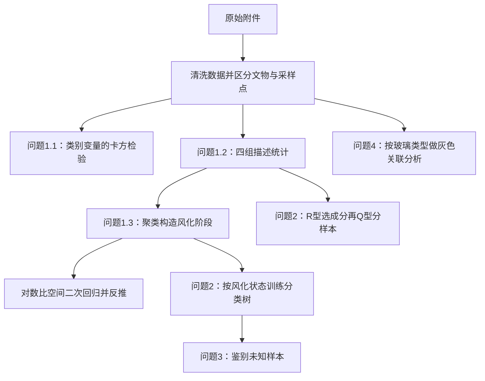

# C155 论文逐题解读：解题思路、方法选择与模型建立

解读对象：《基于成分数据的古代玻璃制品的成分分析与鉴别》，2022 年高教社杯全国大学生数学建模竞赛 C 题优秀论文 C155。

- [论文原文 C155.pdf](../../../准备资料/往年优秀论文/2022年高教社杯全国大学生数学建模竞赛优秀论文/C155.pdf)
- [2022 年 C 题题目](../../../准备资料/往年真题/2022年（A、B、C、D、E题）/C题/C题.pdf)
- [题目原始附件](../../../准备资料/往年真题/2022年（A、B、C、D、E题）/C题/附件.xlsx)

本文按“题目要求 → 方法选择 → 模型建立 → 求解结果”的顺序解释四道题。页码均指原 PDF 页码，与论文印刷页码一致。标注为“论文结果”的数字来自原文；为帮助理解而整理的公式、例子会另作说明。本目录已有的复现程序是补写实现，其修正不能直接当成作者原方法。

## 一、先看整篇论文的解题框架

这篇论文把题目拆成了几种不同任务：**分类变量之间的关系检验、化学成分的分组描述、风化前成分的反推、已知类别的监督分类、类别内部的无监督聚类，以及成分之间的关联分析。**

| 题目任务 | 论文主要方法 | 模型怎样建立 | 最终输出 | 原文位置 |
|---|---|---|---|---|
| 问题 1.1：风化与类型、纹饰、颜色有何关系 | 列联表、Pearson 卡方检验；原文另标注 Yates 校正 | 分别建立三组“表面风化 × 类别变量”列联表，比较实际频数与独立假设下的期望频数 | 三组检验结果 | p5–8，表2–7 |
| 问题 1.2：不同类型风化前后有哪些统计规律 | 分组描述统计、箱线图 | 按玻璃类型和表面风化分成四组，比较每种成分的中心、离散程度和分布形状 | 描述统计表与四组箱线图 | p8–11，表8、图1 |
| 问题 1.3：如何预测风化前成分 | Ward Q 型聚类、中心化对数比变换、二次回归、曲线平移与逆变换 | 用聚类构造四个风化阶段，在对数比空间拟合各成分的阶段变化，再反推到未风化阶段 | 各风化点的风化前成分预测 | p11–18，表9–18、图2–3 |
| 问题 2：如何区分高钾/铅钡并细分亚类 | 决策树、R 型聚类、Q 型聚类、随机扰动 | 先分别训练有无风化两棵分类树；再在四组内对成分聚类、选代表成分、对样本聚类 | PbO 分类规则、亚类成员、稳定性分析 | p18–24，表19–25、图4–7 |
| 问题 3：如何鉴别未知玻璃 | 已训练决策树、Q 型聚类对照、决策边界距离 | 按表单3风化状态选择分类树，代入 PbO，另用聚类比较结果 | A1–A8 的类型及分类稳定性解释 | p24–25，表26–27 |
| 问题 4：不同类型成分的关联有什么差异 | 灰色关联分析 | 分类型，以每种成分轮流作参考序列，计算其他成分的灰色关联度 | 关联排序、两类玻璃的关联差异 | p25–28，图8–9、表28 |

阅读时可以沿着下面这条主线：

**需要区分模型名称与实际完成的工作：**p3 的问题分析提到“梯度提升决策树”，但后续建模、结果和公开附录没有给出对应的训练与评估，能明确核对的是两棵基于 PbO 的决策树。附录也有被注释的灰色预测代码；正文第一问实际采用二次回归，第四问采用灰色关联分析。不能把这些都列成已完成的模型。

## 二、建模前：论文如何理解和处理数据

### 2.1 先分清统计对象和数据来源

| 数据表 | 一行代表什么 | 提供的信息 | 用于哪些任务 |
|---|---|---|---|
| 表单1 | 一件文物 | 类型、纹饰、颜色、表面风化 | 问题1.1；为采样点匹配文物属性 |
| 表单2 | 一个已知类别文物的采样点 | 14 种化学成分百分含量 | 问题1.2、1.3、2、4 |
| 表单3 | 一个待鉴别记录 | 表面风化与化学成分百分含量 | 问题3 |

表单1共有 58 件文物，表单2共有 69 个采样点。一个文物可能有多个采样点，所以“文物数量”和“采样点数量”不能混用。

14 种成分为：SiO₂、Na₂O、K₂O、CaO、MgO、Al₂O₃、Fe₂O₃、CuO、PbO、BaO、P₂O₅、SrO、SnO₂、SO₂。

题目还区分了普通采样点、部位1/2、未风化点、严重风化点。尤其要注意：**一件表面风化的文物，仍然可能有明确标注的未风化采样点。**论文后面还会用聚类推断风化分组，这又是模型判断，与附件中的观测属性要分开。

### 2.2 剔除无效数据，处理空白（p4–5）

设第 \(i\) 个采样点第 \(j\) 种成分的原始百分含量为 \(x_{ij}\)，先计算：

$$
s_i=\sum_{j=1}^{14}x_{ij}.
$$

按题意，只有 \(85\leq s_i\leq105\) 的样本有效。论文剔除采样点 **15、17**，保留 67 个有效采样点，其中高钾 18 个、铅钡 49 个。

这个判断必须在归一化之前做，否则归一化会把所有样本的总和变成 100%，使无效样本也“看起来合格”。

对于两类空白，作者采用不同办法：

- 化学成分空白：题目说明为未检测到该成分，论文填为 0。
- 颜色空白：不猜测颜色；只在分析“颜色与风化”时排除文物 19、40、48、58，因此该检验使用 54 件文物。其他两组列联检验仍使用 58 件。

### 2.3 为什么先做闭合，再讨论对数比变换（p4–5）

这些数据描述的是“整体中各成分的占比”，受到总和约束。作者先将每行闭合到 1：

$$
p_{ij}=\frac{x_{ij}}{\sum_{\ell=1}^{14}x_{i\ell}},
\qquad \sum_{j=1}^{14}p_{ij}=1.
$$

需要百分比时再乘 100。例如，三个成分的检测值为 60、30、5，总和为 95，闭合后为约 63.16%、31.58%、5.26%。这是说明闭合方法的例子，不是附件中的具体样本。

为什么还要变换？因为一个成分的比例上升，会挤压其他成分的比例；直接分析百分比，容易把这种总和约束造成的变化与实际联系混在一起。作者因此引入**中心化对数比变换 CLR**。对于全部为正的 \(D\) 维组成：

$$
g(\boldsymbol p_i)=\left(\prod_{j=1}^{D}p_{ij}\right)^{1/D},
\qquad z_{ij}=\ln\frac{p_{ij}}{g(\boldsymbol p_i)}.
$$

它比较的是“该成分相对于这行成分几何均值的大小”。变换后可以出现负数，因此负坐标不表示负含量。p5 正文缩写写成了 `alr`，但式（2）实际给出的是 CLR 公式，二者不要混淆。

**零值是这一步的关键实现问题。**零不能直接取对数。附录D实际只用每行非零成分计算几何均值，对非零项取对数比，原零位填 0。因此，这篇论文的实际处理不是固定 14 维正组成上的标准 CLR；而且 CLR 坐标为 0 也可能表示原成分恰好等于几何均值，不能据此认定原成分未检出。

另一个容易误解的地方是：CLR 便于用欧氏空间中的方法分析相对组成，但坐标仍满足 \(\sum_j z_{ij}=0\)，并没有让 14 个坐标变成完全独立的变量。

### 2.4 各步骤并非统一使用同一种数据

| 步骤 | 能从原文确认的输入口径 |
|---|---|
| 风化与类别变量的关系 | 表单1的类别频数，类别编码只是标签 |
| 描述统计、图1箱线图 | 表8出现负数，展示的是对数比变换后的坐标，不能把数值直接读成百分比 |
| 第一问的风化点与阶段聚类 | p12 明确使用未经中心化对数比变换的数据；附录B使用欧氏距离和 Ward 方法 |
| 风化前预测中的回归 | p14 明确使用中心化对数比变换后的数据 |
| PbO 决策树 | 使用与原始百分含量对应的阈值 8.495、6.155 |
| 第二问亚类划分 | 明确了 R 型选成分、Q 型分样本，但没有完整交代各处的输入空间及全部软件参数 |
| 第四问灰色关联 | 明确给出除以各成分均值的无量纲化公式；完整前置输入和权重设置未公开 |

实际学习或编程时，先确认输入空间，再套公式。把 8.495 这个原始含量阈值直接用到 CLR 坐标上，就已经换了模型。

### 2.5 原文先提出了哪些假设（p2）

作者列出四条假设：文物形状对结果没有显著影响；风化表面不会影响未风化表面；文物风化过程中不会发生剧烈环境变化；古代玻璃中的气泡不影响定量分析。

这些假设用于简化环境、形状和检测因素。后续预测还实际依赖一个更关键的假设：不同样本的聚类分组能够代表共同风化过程的不同阶段。第三节会说明这一假设怎样进入模型。

## 三、问题一：风化关系、统计规律与风化前预测

### 3.1 第一小问：表面风化与类型、纹饰、颜色有什么关系

题目要求：判断类型、纹饰、颜色这三个分类变量分别与“是否表面风化”存在什么关联。

为什么选卡方检验：这些变量都是类别。给颜色编码为 0、1、2，并不意味着颜色具有可计算的数值距离；因此作者比较各类别中风化与未风化的出现频数。

#### 建模步骤

先建立三张列联表：风化 × 类型为 \(2\times2\)，风化 × 纹饰为 \(2\times3\)，风化 × 颜色为 \(2\times8\)。

以“风化与玻璃类型”为例，原文表5对应：

| 表面状态 | 高钾 | 铅钡 | 合计 |
|---|---:|---:|---:|
| 无风化 | 12 | 12 | 24 |
| 风化 | 6 | 28 | 34 |
| 合计 | 18 | 40 | 58 |

提出假设：

- \(H_0\)：表面风化与玻璃类型独立。
- \(H_1\)：表面风化与玻璃类型有关联。

在独立假设下，第 \((a,b)\) 格的期望频数为：

$$
E_{ab}=\frac{\text{第 }a\text{ 行合计}\times\text{第 }b\text{ 列合计}}{N}.
$$

例如，“无风化且高钾”的期望频数是 \(24\times18/58\approx7.45\)，实际观察到 12 件。把各格偏离加总，得到 Pearson 统计量：

$$
\chi^2=\sum_a\sum_b\frac{(O_{ab}-E_{ab})^2}{E_{ab}},
\qquad df=(r-1)(c-1).
$$

作者用 SPSSPRO 求统计量和 \(p\) 值，并在显著性水平 0.05 下判断。

#### 论文结果（p6–8）

| 关系 | 原文统计量 | 原文 \(p\) 值 | 如何理解 |
|---|---:|---:|---|
| 风化与类型 | 6.880 | 0.009 | 有统计关联证据 |
| 风化与纹饰 | 4.957 | 0.084 | 在 0.05 水平下未发现充分关联证据 |
| 风化与颜色 | 6.287 | 0.507 | 在 0.05 水平下未发现充分关联证据 |

从原文列联表还可以算出：高钾文物风化比例为 \(6/18\approx33.3\%\)，铅钡为 \(28/40=70\%\)。这个描述性差异有助于理解检验结果，但它不单独证明玻璃类型导致风化。

**原文检验表述需要辨别：**作者发现纹饰、颜色列联表中低期望频数较多，把后两项方法标为“Yates 校正卡方检验”，但其统计量与前面的未校正 Pearson 值相同。Yates 校正通常用于 \(2\times2\) 表，不能直接当成任意稀疏列联表的通用处理。另外，\(p\geq0.05\) 不等于证明“独立不相关”。理解论文时，可以保留其检验流程，同时采用表中更准确的结论措辞。

### 3.2 第二小问：不同玻璃类型在有无风化时有什么统计规律

**题目要求：**在区分高钾和铅钡的前提下，描述成分分布与风化的关系。

**论文方法：**分组描述统计与箱线图。这一小问主要描述数据，还没有进行风化前含量预测。

#### 第一步：按两个因素分成四组

作者依据表单1的文物类型与表面风化属性给采样点分组。剔除无效点后，各组数量为：

| 组别 | 采样点数 |
|---|---:|
| 高钾无风化 | 12 |
| 高钾风化 | 6 |
| 铅钡无风化 | 13 |
| 铅钡风化 | 36 |

这里是文物表面属性的分组，与下一小问聚类推断出的“风化点/非风化点”分组不同。

#### 第二步：为每组的每种成分计算描述统计量

对某组某成分的坐标 \(z_1,\ldots,z_n\)，计算均值、最大值、最小值、标准差，以及变异系数、偏度和峰度。主要目的分别是：

| 指标 | 想看什么 |
|---|---|
| 均值、最大值、最小值 | 典型水平和取值范围 |
| 标准差 | 样本围绕均值的波动 |
| 变异系数 \(CV=s/\bar z\) | 作者试图衡量相对离散程度 |
| 偏度 | 分布是否不对称、尾部偏向哪边 |
| 超额峰度 | 相对于正态分布的尾部和形状特征 |

原文用 Python 计算，正文只展示“铅钡风化”组的表8。例如 SiO₂ 的平均值约为 2.242，PbO 为 2.402；它们是变换后的坐标，**不表示 SiO₂ 为 2.242%、PbO 为 2.402%**。

#### 第三步：用箱线图比较分布

p11 图1把四组中的成分分布并排展示。看图时主要比较中位数、四分位区间、须和离群点，判断哪些成分在有无风化两组之间发生明显位移，哪些成分样本差异较大。

作者据此概括的现象包括：

- 铅钡玻璃：SiO₂、Fe₂O₃、P₂O₅、SrO 在风化组中的相对水平下降。
- 高钾玻璃：K₂O、CaO、Al₂O₃、Fe₂O₃ 等相对水平下降，SiO₂ 相对水平上升。
- 两类玻璃的成分变化模式不同，因此后面的风化预测和分类要分别考虑玻璃类型及风化状态。

这些是作者对横截面分组图的解释。单凭这样的比较，不能确认同一件文物实际发生了何种元素迁移，也不能把 CLR 坐标变化直接等同于绝对含量变化。原文 p11 写高钾 SiO₂ 增多，p12 却写减少，前后也存在方向矛盾。

另外，CLR 坐标可正可负、均值可能接近 0，通常不适合用 \(CV=s/\bar z\) 作相对离散度比较。原文偏度解释中“哪边的数据更多”的说法也不严谨；箱体之外的点则不自动等于异常值。这些不影响理解其“分组统计 → 找差异 → 指导后续分组建模”的主线。

### 3.3 第三小问：怎样根据风化点反推风化前的成分

这是全文建模最复杂的部分。题目没有提供每个风化点对应的真实风化前数据，作者必须建立一条从现状回到未风化状态的规则。

论文采用的思路是：

> 在同一种玻璃内部，先依据成分相似性聚类，把不同组解释为不同风化阶段；再在对数比空间拟合“成分随阶段变化”的曲线，把具体样本的曲线移回未风化阶段，最后恢复成百分比。

#### 第一步：按玻璃类型分开，使用 Q 型聚类识别要预测的点（p11–13）

这里 **Q 型聚类的对象是采样点**。每个点由一行化学成分描述，相似的点应归到一起。

论文采用离差平方和法，即 Ward 层次聚类。设分组为 \(G_1,\ldots,G_K\)，组中心为 \(\bar{\boldsymbol x}_k\)，组内离差平方和为：

$$
S=\sum_{k=1}^{K}\sum_{i\in G_k}
\left\|\boldsymbol x_i-\bar{\boldsymbol x}_k\right\|_2^2.
$$

从每个样本单独一类开始，每次合并使 \(S\) 增加最少的两类。它是逐步合并的算法，并不保证找到所有可能分组中 \(S\) 最小的全局解。

作者先分别把高钾、铅钡分成两簇，再根据已有风化信息和成分差异，把簇解释为“未风化点”和“风化点”。表9–10的数量为：

| 类型 | 聚类后解释为未风化的点 | 聚类后解释为风化、需要预测的点 |
|---|---:|---:|
| 高钾 | 9 | 9 |
| 铅钡 | 20 | 29 |
| 合计 | 29 | 38 |

例如，高钾待预测点为 07、09、10、12、22、27、03部位1、18、21。

这里的分组包含作者的推断。例如 03部位1、18、21 被划入风化点，不能把该结论冒充为附件直接观测到的风化属性。

#### 第二步：构造四个“风化阶段”（p13）

作者进一步得到四组，并赋予顺序：

$$
t=1:\text{未风化},\quad
 t=2:\text{轻度风化},\quad
 t=3:\text{中度风化},\quad
 t=4:\text{严重风化}.
$$

正文说选定四类；附录B的具体流程是先二分，再分别对两个分支二分。表11–12给出的分组规模如下：

| 作者赋予的阶段 | 高钾点数 | 铅钡点数 |
|---|---:|---:|
| 未风化 | 2 | 9 |
| 轻度风化 | 7 | 11 |
| 中度风化 | 6 | 22 |
| 严重风化 | 3 | 7 |

例如，表11把高钾的 06部位1、06部位2放在第一阶段；07、09、10、12、22、27放在第三阶段；03部位1、18、21放在第四阶段。

**这里的 \(t\) 是作者构造的阶段编号，不是实际经过的年份。**这一步实际上增加了一个很强的建模假设：同类型不同文物之间的成分差异，可以主要解释为共同风化过程中的阶段差异。聚类本身只能给出相似性分组，不能自动证明阶段顺序。

#### 第三步：在对数比空间中提取各阶段中心（p14）

为避免直接独立预测 14 个百分比后总和不等于 100%，作者改在对数比空间拟合。

设类型为 \(g\)，阶段为 \(t\)，成分为 \(j\)。计算对应组的平均坐标：

$$
\bar z_{g,t,j}=\frac{1}{n_{g,t}}
\sum_{i\in G_{g,t}}z_{ij}.
$$

于是，对每一种玻璃、每一种成分，都得到四个拟合点：

$$
(1,\bar z_{g,1,j}),\quad (2,\bar z_{g,2,j}),\quad
(3,\bar z_{g,3,j}),\quad (4,\bar z_{g,4,j}).
$$

这样做等于用组中心代表该阶段的典型组成，以减少直接使用单个样本时的波动。

**原文阶段顺序存在实质性矛盾：**高钾表11的第三、第四组，与表13中心数值对应的组别反过来了。表13中 SiO₂ 的四个中心约为 3.18、3.07、3.39、4.19；按表11成员顺序计算，后两个中心应为约 4.19、3.39。后面表15的回归对应表13顺序。复现时必须明确采用哪套顺序。

#### 第四步：对每一种成分拟合二次函数（p15）

作者为每类玻璃的每种成分建立：

$$
f_{g,j}(t)=a_{g,j}t^2+b_{g,j}t+c_{g,j}.
$$

附录B使用 MATLAB 的 `polyfit(..., 2)`，即对四个组中心做二次最小二乘拟合。其目标可整理为：

$$
\min_{a,b,c}\sum_{t=1}^{4}
\left[\bar z_{g,t,j}-(at^2+bt+c)\right]^2.
$$

论文分别列出 14 条高钾方程、14 条铅钡方程。例如：

| 类型与成分 | 论文回归方程 | 论文 \(R^2\) |
|---|---|---:|
| 高钾 SiO₂ | \(f(t)=0.22723t^2-0.80111t+3.7528\) | 0.9998 |
| 铅钡 SiO₂ | \(f(t)=-0.3396t^2+1.0705t+2.3223\) | 0.8838 |

这些方程预测的是对数比坐标，不能直接把函数值当成百分含量。

作者对 \(R^2\) 较低的成分采用“不变策略”。附录具体跳过高钾 Na₂O、SnO₂、SO₂，以及铅钡 K₂O、MgO 的坐标更新。其想法是：这些成分没有表现出作者所设曲线能够描述的稳定阶段趋势。

但低 \(R^2\) 不能证明“不受风化影响”；而且只有四个中心、二次函数有三个参数，拟合得很好也不足以证明预测准确。跳过坐标更新后，最终逆变换的百分比还可能因总和归一化而改变。

#### 第五步：针对具体风化点，把曲线移回 \(t=1\)（p16）

仅计算 \(f_{g,j}(1)\)，会让同类型所有待预测点得到相同的该成分坐标。为了保留个体差异，作者比较每个样本与其阶段的拟合曲线之间的偏离。

省略类型、成分下标，设样本处于阶段 \(t_i\)，其检测坐标为 \(z_i\)。如果严格按图3所示的垂直平移，使曲线经过这个点，那么：

$$
e_i=z_i-f(t_i),
\qquad
\hat z_i^{\mathrm{before}}=f(1)+e_i.
$$

这条式子是对图3平移思路的数学整理：先计算样本相对于“同阶段典型值”的偏差，再把这个偏差加到“未风化典型值”上。

论文随后又担心个别点偏离过大，提出把距离 \(d\) 改成 \(\sqrt d\)，再用于平移，意图减弱大偏离值的影响。因此其最终方法还含有一层经验性的残差变换。

这部分要保留原文的不确定性：正文令 \(d=f(t)-z\)，没有完整处理 \(d<0\) 时的平方根；附录的正负分支、阶段代入也存在疑点。不能把上面的纯平移公式称为原文最终完整算法。若实现“带符号平方根残差”以保持实数运算，那属于明确补充的定义，而不是原文已经严密写出的结论。

#### 第六步：逆变换，恢复为总和 100% 的成分（p16）

在各成分均纳入逆变换的情况下，式（11）可以等价整理成：

$$
\hat p_{ij}=\frac{\exp(\hat z_{ij})}
{\sum_{\ell=1}^{D}\exp(\hat z_{i\ell})},
\qquad
\hat x_{ij}=100\hat p_{ij}.
$$

因此输出非负、总和为 100%。原文用“减去一个参考坐标”的写法实现同一类归一化。

这解释了作者为什么强调成分数据方法：**最后的逆变换保证预测结果满足组成约束。**满足总和约束是输出合法性的条件，并不是恢复值正确的证明。

附录C还会排除预测坐标中的零值，而“坐标为零”和“原始成分未检出”不等价，所以有零样本的实现需要另外处理。

#### 论文输出与验证（p17–18、附录A）

作者对前述 38 个点进行预测，表17展示高钾结果，表18展示部分铅钡结果。例如：

| 样本 | 论文预测风化前 SiO₂ | 论文预测风化前 K₂O | 论文预测风化前 CaO |
|---|---:|---:|---:|
| 高钾 07 | 69.63% | 6.32% | 3.29% |
| 高钾 03部位1 | 56.03% | 12.72% | 5.20% |
| 铅钡 08 | 67.39% | 0% | 0.23% |

这些是论文报告的预测值，不是题目给出的真实风化前观测值。

作者用两种方式说明结果合理：一是比较预测值与未风化样本的成分；二是把预测数据与原检测数据混在一起，使用平均联接聚类，发现预测数据与已知未风化数据聚在同一类。

这种检验支持“预测结果与未风化群体相似”，但由于没有真实配对的风化前数据，不能据此计算真实恢复误差或证明每个点预测准确。

## 四、问题二：两类玻璃如何分类，又怎样划分亚类

### 4.1 第一部分：学习高钾与铅钡的分类规律

**题目要求：**利用已有类别标签，找出可解释的玻璃类型判别规则。

**为什么选决策树：**表单2的类别已知，可以做监督分类；决策树又可以把结果写成简明的“成分含量是否超过阈值”的规则。

#### 第一步：先按风化状态分开训练（p18）

作者认为风化会改变成分含量，所以使用前面识别的风化点、未风化点分组，分别训练一棵树。每组中：

- 输入：各化学成分含量。
- 标签：高钾或铅钡。
- 数据划分：70% 训练集，30% 测试集。

这样可以允许同一个成分在两种风化状态下有不同的分类边界。

#### 第二步：用信息增益选择划分（p18）

论文介绍 ID3 决策树及信息增益。设数据集 \(D\) 中两类比例为 \(p_1,p_2\)，信息熵为：

$$
H(D)=-\sum_{c=1}^{2}p_c\log_2p_c.
$$

用某个成分 \(A\) 和阈值 \(\tau\) 把数据划成 \(D_L,D_R\) 后，可把信息增益写为：

$$
\operatorname{Gain}(D,A,\tau)=H(D)
-\frac{|D_L|}{|D|}H(D_L)
-\frac{|D_R|}{|D|}H(D_R).
$$

信息增益大，表示划分后类别更纯。例如若一侧全是高钾、另一侧全是铅钡，则两侧类别的不确定性都降到 0。

上式是针对正文连续含量阈值的解释性写法。原文使用 SPSSPRO，未公开其连续变量候选阈值生成、随机种子及完整参数，所以不能仅凭“ID3”名称认定软件具体实现完全已知。

#### 论文得到的规则（p18–20，图4–5）

两棵树最后都只用 **PbO 原始百分含量**划分：

| 风化状态 | 判为高钾玻璃 | 判为铅钡玻璃 |
|---|---|---|
| 未风化点 | PbO ≤ 8.495% | PbO > 8.495% |
| 风化点 | PbO ≤ 6.155% | PbO > 6.155% |

这与铅钡玻璃含铅较高的背景相吻合，也便于直接应用到未知样本。

原文表19、20报告：两棵树在训练集、测试集上的精确率、召回率、准确率、F1 均为 1。这是作者本次样本划分的结果。论文没有公开完整训练/测试名单，不能把它理解为对所有新玻璃都能达到 100% 准确率。

作者还用两个阈值的差别解释风化对分类的影响。能直接支持的是“这两组训练数据给出了不同边界”；单凭两个边界，不能证明每件玻璃的 PbO 都会随风化按同一方向变化。

### 4.2 第二部分：先选成分，再对样本划分亚类

**题目要求：**在高钾、铅钡两大类内部继续细分，并说明选择哪些化学成分作为依据。

这部分没有现成的亚类标签，因此作者使用无监督聚类：

> 按类型与风化分成四组 → R 型聚类寻找相互关联的成分群 → 每群选一个代表成分 → 用这些代表成分做 Q 型聚类，划分样本。

#### R 型与 Q 型究竟有什么区别

| 聚类形式 | 聚类对象 | 此处回答的问题 |
|---|---|---|
| R 型聚类 | 数据矩阵的列，即化学成分 | 哪些成分信息相似，应该选哪些代表变量？ |
| Q 型聚类 | 数据矩阵的行，即采样点 | 哪些玻璃样本的成分特征相似，应分为同一亚类？ |

“R 型、Q 型”说明聚类对象；具体如何算距离、如何合并类，还需要另外指定。

#### 第一步：用相关性定义成分之间的距离（p20–21）

在四组中分别计算成分 \(j,k\) 的 Pearson 相关系数。以下用 \(q_{ij}\) 表示实际送入相关分析的成分数据，避免在原文输入空间未完全交代时，将其直接等同于原始百分含量：

$$
r_{jk}=\frac{\sum_i(q_{ij}-\bar q_j)(q_{ik}-\bar q_k)}
{\sqrt{\sum_i(q_{ij}-\bar q_j)^2}
\sqrt{\sum_i(q_{ik}-\bar q_k)^2}}.
$$

论文以：

$$
d_{jk}=1-|r_{jk}|
$$

作为成分距离。强正相关和强负相关都会得到较小距离，因为作者关心的是关联强度和信息重复程度，而不要求变化方向相同。

类与类之间使用最短距离法，即单联接：

$$
d(G_a,G_b)=\min_{j\in G_a,k\in G_b}d_{jk}.
$$

随后将 14 种成分聚成三组，再在每组选择一个有代表性的成分。原文用 MATLAB 计算相关矩阵及 R 型聚类结果，见图6、表21–24。

#### 第二步：选取三个代表成分（p22–24）

按照表25明确列出的最终扰动变量，作者使用：

| 四组样本 | 三个代表成分 |
|---|---|
| 高钾未风化 | SnO₂、CuO、CaO |
| 高钾风化 | SnO₂、CuO、SO₂ |
| 铅钡未风化 | Na₂O、CuO、SiO₂ |
| 铅钡风化 | Al₂O₃、CuO、SrO |

这里把高维成分信息压缩为三维代表特征，属于特征筛选。论文没有给出一个完整、可自动执行的“代表性最大”判据；而且高钾未风化在表21标星的 SO₂，与表25列出的 CaO 不一致。因此表25应理解为作者明确报告的一套最终使用变量，不能说其由公开步骤唯一确定。

此外，某些成分在组内全为 0，相关系数会成为 NaN，原文图6也承认了这一点；这种变量不能未经处理直接套入 Pearson 距离。

#### 第三步：用三个代表成分对样本做 Q 型聚类（p22–23）

例如，一个高钾未风化样本只保留三个代表成分的数据：

$$
\boldsymbol u_i=(q_{i,\mathrm{SnO_2}},q_{i,\mathrm{CuO}},q_{i,\mathrm{CaO}}).
$$

对这些三维样本做 Q 型聚类，形成同组内部的亚类。前文 Q 型聚类使用 Ward 法；亚类章节没有重新完整列出所有距离、尺度处理和软件参数，因此复现时还要明确这些设置。

原文图7最终给出：**四组各分为两个亚类，共八个叶子分组。**例如高钾风化组分为：

- 亚类一：07。
- 亚类二：09、10、12、22、27。

其余组的具体成员可对照 p23 图7。这些亚类是根据当前样本的成分相似性形成的分组，作者没有进一步为其证明确定的产地、年代或制作工艺含义。

### 4.3 第三部分：如何分析合理性与敏感性

#### 合理性分析（p23）

作者主要给出方法层面的解释：四组分开避免混合不同风化模式；先做 R 型聚类可以了解成分间的信息重复，再选代表变量进行样本聚类，使亚类划分有成分选择依据。

这是一种可解释的设计理由。原文没有通过完整的轮廓系数比较、独立标签验证或消融实验，定量证明其一定优于直接使用 14 种成分聚类。

#### 敏感性分析（p23–24）

作者改变代表成分的数值，再观察亚类成员是否改变。其扰动方式为把原值 \(x\) 替换成区间内的随机数：

$$
x'\in[(1-p)x,(1+p)x].
$$

例如 \(p=0.15\) 表示上下浮动 15%。原文没有完整说明随机分布、重复次数及种子。

表25报告的“划分不改变”的扰动范围为：

| 组别 | 代表成分及论文报告的范围 |
|---|---|
| 高钾未风化 | SnO₂ ±10%；CuO ±15%；CaO ±15% |
| 高钾风化 | SnO₂ ±15%；CuO ±15%；SO₂ ±15% |
| 铅钡未风化 | Na₂O ±20%；CuO ±20%；SiO₂ ±5% |
| 铅钡风化 | Al₂O₃ ±15%；CuO ±10%；SrO ±15% |

表中实际包含 5%，所以不能只照抄正文所说的“均在 10%–20%”。而且有限次随机试验只能支持经验稳定性，不能证明区间内“无论抽取何数”都不改变划分。原值为 0 时，乘性扰动仍然是 0，也测不到从未检出变为少量检出的影响。

## 五、问题三：怎样鉴别 A1–A8，怎样判断结果稳定

### 5.1 复用第二问的决策树（p24–25）

作者使用表单3给出的表面风化属性，决定调用哪棵树，再代入 PbO 原始百分含量。

完整规则可以整理为：

$$
\hat y(w,x_{\mathrm{PbO}})=
\begin{cases}
\text{高钾},& w=0,\ x_{\mathrm{PbO}}\leq8.495,\\
\text{铅钡},& w=0,\ x_{\mathrm{PbO}}>8.495,\\
\text{高钾},& w=1,\ x_{\mathrm{PbO}}\leq6.155,\\
\text{铅钡},& w=1,\ x_{\mathrm{PbO}}>6.155.
\end{cases}
$$

其中 \(w=0\) 表示无风化，\(w=1\) 表示风化。这里输入 PbO 的数值单位为百分含量，例如 12.23，而不是比例 0.1223。

| 未知样本 | 表面风化 | PbO 原始含量 | 使用阈值 | 论文鉴别结果 |
|---|---|---:|---:|---|
| A1 | 无风化 | 0% | 8.495% | 高钾 |
| A2 | 风化 | 34.30% | 6.155% | 铅钡 |
| A3 | 无风化 | 39.58% | 8.495% | 铅钡 |
| A4 | 无风化 | 24.28% | 8.495% | 铅钡 |
| A5 | 风化 | 12.23% | 6.155% | 铅钡 |
| A6 | 风化 | 0% | 6.155% | 高钾 |
| A7 | 风化 | 0% | 6.155% | 高钾 |
| A8 | 无风化 | 21.24% | 8.495% | 铅钡 |

因此，原文表26的结论是：**A1、A6、A7 为高钾；A2、A3、A4、A5、A8 为铅钡。**

这一步没有重新拟合风化前含量，也没有给未知样本另建新分类器，而是把第二问得到的类型判别规则直接用于新记录。

原文认为表单3代表“整体文物的比例”、区别于表单2的随机点采样，并用此说明为何直接采用其风化标签。但题目并未提供充分依据支持这种“整体/局部”的区别，学习时应把直接采用标签视为作者的处理选择。

### 5.2 用 Q 型聚类做结果对照（p25）

作者再按有无风化分别做 Q 型聚类，用聚类分组对照决策树分类。表27给出的类型名单与表26相同，作者据此认为鉴别结果可信。

这里的“交叉检验”指两种方法给出一致结论，不能理解成机器学习中的交叉验证，也不是与未知样本真实类型比较。表单3没有提供真值，因而这里不能直接证明未知样本的准确率为 100%。

### 5.3 敏感性主要看 PbO 距阈值有多远

与第二问的重新聚类扰动不同，第三问正文主要比较未知样本 PbO 与分类阈值的差距，认为没有样本紧贴边界。

可以把作者的解释整理成边界距离：

$$
m_i=|x_{i,\mathrm{PbO}}-\tau_{w_i}|.
$$

\(m_i\) 越大，在其他输入和模型保持不变时，就越能容纳 PbO 的加性测量偏差。

例如，A5 为风化样本：

$$
m_{A5}=12.23-6.155=6.075\text{ 个百分点}.
$$

其 PbO 需要下降到 6.155% 或更低，才会从铅钡变成高钾；相对于原值，这需要约 \(6.075/12.23\approx49.7\%\) 的下降。该百分比是根据论文数值补充计算的边界解释。

A1、A6、A7 的 PbO 为 0，按乘性扰动仍保持 0；这只表示对这种扰动方式稳定，不能代表对所有测量误差都稳定。

因此，第三问的完整解题链是：**根据风化状态选树 → 根据 PbO 判类 → 用聚类结果对照 → 用边界距离解释对输入偏差的容忍程度。**原文所说的“敏感性较高”更适合表述为“对小幅扰动不敏感、结果较稳定”。

## 六、问题四：化学成分之间有什么关联，两类玻璃有什么差异

### 6.1 为什么采用灰色关联分析（p25）

第四问需要给出成分之间的关联关系，并比较两种玻璃的差异。作者采用灰色关联分析，通过标准化后不同成分在各样本上的变化轮廓是否接近，构造相似程度指标。

它与第二问的 Pearson 相关用途不同：

| 方法 | 本文中的用途 | 主要刻画什么 |
|---|---|---|
| Pearson 相关 | R 型聚类时判断成分之间是否信息相似 | 线性关联及其方向 |
| 灰色关联 | 分析、排序各成分与参考成分的接近程度 | 经指定无量纲化后的序列相似性 |

灰色关联度较大，可以按作者的定义解释为序列更接近；它不等同于 Pearson 相关系数，也不直接表示因果关系。

### 6.2 模型建立的六个步骤（p25–26）

#### 第一步：分别取出高钾、铅钡样本

两类各建立一套关联分析。对某一类型，设有 \(n\) 个采样点，某成分的序列为：

$$
X_j=(x_{1j},x_{2j},\ldots,x_{nj}).
$$

这里序列中的位置对应样本，不是时间。第四问也没有继续按照第一问的四个风化阶段拟合动态模型。

#### 第二步：指定母序列与子序列

先以 SiO₂ 为母序列（参考序列），其余 13 种成分作为子序列（比较序列）。计算完成后再轮换，使每种成分都做一次母序列。

这样，每种玻璃类型都可以形成一套 \(14\times14\) 的成分关联度结果。母序列只是当前比较基准，不代表该成分已被证明决定其他成分。

#### 第三步：进行均值无量纲化

每一种成分各自除以在该类型样本中的平均值：

$$
\bar x_j=\frac1n\sum_{i=1}^{n}x_{ij},
\qquad
u_{ij}=\frac{x_{ij}}{\bar x_j}.
$$

这样可以降低不同成分量级差异的影响，更侧重它们相对于自身平均水平的变化。如果某列全为 0，均值也为 0，这一步不能直接计算，需要明确排除或另行处理。

#### 第四步：计算与母序列的绝对差

设当前母成分为 \(j_0\)，对每个其他成分 \(j\) 与样本位置 \(i\)：

$$
\Delta_j(i)=|u_{i,j_0}-u_{ij}|.
$$

在当前母序列的全部比较成分和全部样本位置上，求：

$$
\Delta_{\min}=\min_{j\ne j_0,i}\Delta_j(i),
\qquad
\Delta_{\max}=\max_{j\ne j_0,i}\Delta_j(i).
$$

#### 第五步：计算灰色关联系数

$$
\xi_j(i)=\frac{\Delta_{\min}+\rho\Delta_{\max}}
{\Delta_j(i)+\rho\Delta_{\max}}.
$$

\(\rho\) 为分辨系数，原文写一般取 0.5。绝对差越小，关联系数越大；该系数衡量的是某一采样位置上的接近程度。

#### 第六步：加权汇总为灰色关联度

$$
\gamma_{j_0,j}=\sum_{i=1}^{n}w_i\xi_j(i),
\qquad w_i\geq0,\quad\sum_{i=1}^{n}w_i=1.
$$

关联度汇总整条序列上的接近程度。若各样本等权，则 \(w_i=1/n\)，相当于取关联系数的平均值。

论文给出了加权公式并用 SPSSPRO 求解，但没有完整公布具体权重及操作设置。因此，等权是便于理解和复算的一种明确选择，不能当成已经由原文证实的全部设置。

### 6.3 论文以 SiO₂ 为母序列的结果（p27–28）

下表转述原文表28，并非本目录程序重新计算的结果：

| 与 SiO₂ 比较的成分 | 高钾灰色关联度 | 铅钡灰色关联度 |
|---|---:|---:|
| Na₂O | 0.893 | 0.899 |
| K₂O | 0.972 | 0.977 |
| CaO | 0.921 | 0.969 |
| MgO | 0.981 | 0.975 |
| Al₂O₃ | 0.980 | 0.667 |
| Fe₂O₃ | 0.982 | 0.973 |
| CuO | 0.951 | 0.978 |
| PbO | 0.970 | 0.991 |
| BaO | 0.962 | 0.987 |
| P₂O₅ | 0.986 | 0.949 |
| SrO | 0.968 | 0.987 |
| SnO₂ | 0.962 | 0.959 |
| SO₂ | 0.962 | 0.932 |

据表28，作者得到：

- 高钾玻璃中，与 SiO₂ 关联度最高的是 P₂O₅（0.986），最低的是 Na₂O（0.893）。
- 铅钡玻璃中，与 SiO₂ 关联度最高的是 PbO（0.991），最低的是 Al₂O₃（0.667）。
- Al₂O₃ 与 SiO₂ 的关联度在两类中相差较大：高钾 0.980，铅钡 0.667。

### 6.4 作者怎样比较两类玻璃的差异（p28）

作者主要比较两件事：关联曲线的分散程度，以及各母序列下关联度的最高、最低成分。

原文概括：高钾的关联系数总体较集中，大多数处于 0.9–1；铅钡的分布波动更大。进一步轮换母序列后，作者报告：

- 两类玻璃以 BaO 或 SrO 为母序列时，均与 PbO 的关联度最高。
- 高钾中，SiO₂ 与 P₂O₅ 互为最高关联对象；铅钡中，SiO₂ 与 PbO 互为最高关联对象。
- 以 PbO 或 CuO 为母序列时，Al₂O₃ 在高钾中的关联度最高，在铅钡中最低。
- 最低关联对象在高钾中多数为 Na₂O，在铅钡中多数为 Al₂O₃。

这些后续结论由论文正文报告；当前 PDF 只完整展示了 SiO₂ 母序列的表28，没有展示全部母序列的数值表。

如果想把“差异”写得更直观，可以补充计算：

$$
\delta_{a,b}=\gamma_{a,b}^{\mathrm{高钾}}
-\gamma_{a,b}^{\mathrm{铅钡}}.
$$

例如 SiO₂–Al₂O₃ 的表中差为 \(0.980-0.667=0.313\)。这是根据原文表格补充的描述性比较，作者没有进一步建立组间差异的显著性检验。

由于灰色关联度依赖无量纲化、分辨系数、极差范围和权重，两类分析的数值差异需要放在相同口径下解释。现有复现材料也记录了表28未能逐值复现的情况，不应把原表参考值冒充计算输出。

## 七、从这篇论文中最值得学会的建模连接

| 建模连接 | 本文怎么做 | 学习时要抓住什么 |
|---|---|---|
| 从题意到统计方法 | 类别关系用列联检验；已知标签用监督分类；无亚类标签用聚类 | 先判断输出目标和数据类型，再选算法 |
| 从描述分析到分组建模 | 发现两类玻璃风化模式不同，后续分别建模 | 前一问的发现应影响后一问的输入和模型结构 |
| 从受约束数据到合法预测 | 在对数比空间预测，再逆变换成比例 | 模型输出需要满足问题固有约束；合法性与准确性要分别检查 |
| 从缺失时间信息到阶段模型 | 聚类后人为赋予风化顺序，再做阶段回归 | 聚类给出的是相似性，时间或阶段含义来自额外假设 |
| 从多变量到可解释规则 | 决策树得到 PbO 阈值；R 型聚类选成分 | 模型不仅要给标签，还应说明判别依据 |
| 从单次结果到稳定性 | 扰动代表成分、比较分类边界距离 | 说明扰动了什么、幅度多大、用什么衡量结果变化 |
| 从数值输出到验证 | 测试集评估、聚类对照、图表比较 | 区分预测准确性、方法一致性、输入稳定性这三种不同证据 |

建议按 p4–5 的数据处理、p11–16 的风化预测、p18–24 的分类与亚类、p25–28 的灰色关联顺序读原文。第一问的阶段构造和反推公式值得重点推敲；第二、三问则适合学习如何把模型输出写成可解释、可直接使用的规则。

## 八、与本目录代码及已有材料对应

下面这些是本目录已有的学习复现入口，含补写和修正，不能全部视为作者原程序：

| 想继续理解的部分 | 对应文件 |
|---|---|
| 数据读取、筛选、采样点口径 | [scripts_tables/data.py](../scripts_tables/data.py) |
| 闭合、论文对数比处理、逆变换 | [scripts_tables/composition.py](../scripts_tables/composition.py) |
| 问题1.1：列联检验 | [scripts_tables/11_association.py](../scripts_tables/11_association.py) |
| 问题1.2：分组描述统计 | [scripts_tables/12_descriptive.py](../scripts_tables/12_descriptive.py) |
| 问题1.3：聚类、回归与风化前预测 | [scripts_tables/13_weathering_prediction.py](../scripts_tables/13_weathering_prediction.py) |
| 问题2：决策树 | [scripts_tables/21_decision_trees.py](../scripts_tables/21_decision_trees.py) |
| 问题2：亚类及扰动分析 | [scripts_tables/22_subclasses.py](../scripts_tables/22_subclasses.py) |
| 问题3：未知样本鉴别 | [scripts_tables/31_identify_unknown.py](../scripts_tables/31_identify_unknown.py) |
| 问题4：灰色关联 | [scripts_tables/41_grey_relations.py](../scripts_tables/41_grey_relations.py) |
| 原文与复现实现的具体差异 | [复现说明.md](复现说明.md) |
| 论文论证的优点和局限 | [论文评价.md](论文评价.md) |
| 原文图表与绘图代码对应 | [图表索引.md](图表索引.md) |
